---
Order: 23
TOCTitle: June 2017
PageTitle: Visual Studio Code June 2017
MetaDescription: See what is new in the Visual Studio Code June 2017 Release (1.14)
MetaSocialImage: 1_14_release-highlights.png
---
# June 2017 (version 1.14)

## Insiders Release

Welcome to the Insiders build. These are the preliminary notes for the June 1.14 release of Visual Studio Code. As we get closer to the release date, you'll see details below about new features and important fixes.

Until the June release notes are available, you can still track our progress:

* **[June Iteration Plan](https://github.com/Microsoft/vscode/issues/28387)** - See what's planned for the milestone.
* **[Commit Log](https://github.com/Microsoft/vscode/commits/master)** - GitHub commits to the vscode open source repository.
* **[Closed bugs](https://github.com/Microsoft/vscode/issues?q=is%3Aissue+label%3Abug+milestone%3A%22June+2017%22+is%3Aclosed)** - Resolved bugs in the June milestone.
* **[Closed feature requests](https://github.com/Microsoft/vscode/issues?q=is%3Aissue+milestone%3A%22June+2017%22+is%3Aclosed+label%3Afeature-request)** - Implemented feature requests.

We really appreciate people taking a look at our new features as soon as they are ready so check back here often and learn what's new to try out.

If you find issues or have suggestions, you can enter them in the VS Code repository on [GitHub](https://github.com/Microsoft/vscode/issues).

## Changes for Extension Authors

Due to security concerns, we don't want to render user provided SVG images within VS Code. We added constraints for extensions to make it safer for users when they browse the extension Marketplace within VS Code:

- The icon provided in `package.json` may not be an SVG.
- The badges provided in the `package.json` may not be SVGs unless they are from trusted badge providers.
- Image URLs in `README.md` and `CHANGELOG.md` need to resolve to `https` URLs.
- Images in `README.md` and `CHANGELOG.md` may not be SVGs unless they are from trusted badge providers.
- Images in `README.md` and `CHANGELOG.md` may not use data URIs.

Below are the URL prefixes which identify trusted badge providers:

- `https://api.travis-ci.org/`
- `https://badge.fury.io/`
- `https://badges.frapsoft.com/`
- `https://badges.gitter.im/`
- `https://badges.greenkeeper.io/`
- `https://cdn.travis-ci.org/`
- `https://ci.appveyor.com/`
- `https://codeclimate.com/`
- `https://codecov.io/`
- `https://coveralls.io/`
- `https://david-dm.org/`
- `https://gemnasium.com/`
- `https://img.shields.io/`
- `https://isitmaintained.com/`
- `https://marketplace.visualstudio.com/`
- `https://snyk.io/`
- `https://travis-ci.com/`
- `https://travis-ci.org/`
- `https://vsmarketplacebadge.apphb.com/`
- `https://www.bithound.io/`

To help you adopt these constraints, VS Code shows linting errors in your extension's `package.json`, `README.md`, and `CHANGELOG.md` files if they are not yet compliant. Also, the `vsce` publishing tool performs compliance checks and prevents you from uploading a new version of your extensions if there are problems.

## Windows 64 bits - Insiders

Visual Studio Code 64 bit builds are now available on Windows for our Insiders. They come in the usual [Setup](https://go.microsoft.com/fwlink/?linkid=852155) format as well as a [ZIP archive](https://go.microsoft.com/fwlink/?linkid=850640). Make sure to uninstall the 32 bit version before you install the 64 bit one.

You should expect 64 bit builds of our Stable version next month.

## Preview: Multi-Root Workspaces

We have been busy this milestone on the development of "[Multi-Root Workspaces](https://github.com/Microsoft/vscode/issues/396)" in VS Code (refer to our [previous release notes](https://code.visualstudio.com/updates/v1_13#_multiroot-workspaces) for the design decisions we made last sprint). The outcome of this work is what we call a "Minimum Viable Product" (MVP) to enable self-hosting on multiple root folder workspaces. The features outlined below are currently only available from our [Insiders](https://code.visualstudio.com/insiders) build and not Stable. We will need another iteration before making this feature available for all users. To try it out, grab our Insiders build from [https://code.visualstudio.com/insiders](https://code.visualstudio.com/insiders).

### File Explorer

The File Explorer can now show multiple root folders in one tree. You can easily add root folders from the **File** menu or context menu:

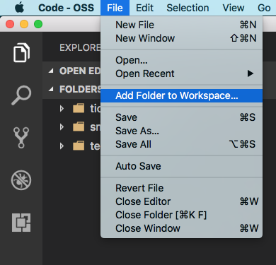

Once a root folder is added, the Explorer will show the new folder as root in the files tree. You can right click on any of the root folders to add more root folders or to remove it.


The File Explorer should work and behave as before. You can move files between root folders and use any of the typical file operation actions provided in the context menu and the Explorer view. Settings like `files.exclude` are supported for each root folder if configured and across all folders if configured as global user setting.

### Search

Full text search and the **Quick Open** file picker take the additional root folders into account. When searching, results from all of the root folders will show up in the search results view:

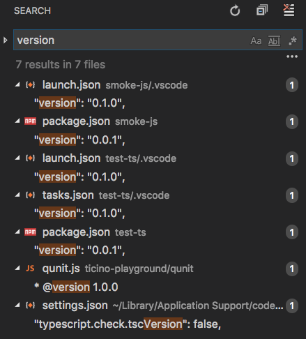

To distinguish results with the same file name across root folders, the name of the root folder is used as prefix to the relative path in the results list. Settings like `search.exclude` are supported for each root folder if configured and across all folders if configured as global user setting.


### Settings

With multiple root folders in one workspace, it is possible to have a `.vscode` folder in each root folder defining the settings that should apply for that folder. We classified settings into Workspace and Folder scoped to determine which setting can be applied at Workspace and Folder level.

A subset of settings is supported at a Folder level in this environment, specifically:

* `editor.*`
* `files.exclude`
* `files.trimTrailingWhitespace`
* `files.insertFinalNewLine`
* `files.encoding`
* `files.autoGuessEncoding`
* `files.watcherExclude`
* `search.exclude`

Other settings are currently not supported on a per-folder basis and we will add more to the above list in the future.

Refer to the [issue](https://github.com/Microsoft/vscode/issues/28538#issuecomment-310613318) to get more information about how settings are applied in a multi-root workspace.

### Proposed multi-root API

Having multiple folders open in the editor requires a more powerful API. From the single root days, there is the `rootPath` API and for compatibility that will remain. We have a new and more powerful API in the pipeline. The current *proposed* API is shown below and enables you to inspect all workspace folders and sends an event when those change. It also helps you in adopting to the new configuration model.

```ts
export namespace workspace {
    /**
    * List of workspace folders or `undefined` when no folder is open. The *first*
    * element in the array is equal to the [`rootPath`](#workspace.rootPath)
    */
    export let workspaceFolders: Uri[] | undefined
    /**
     * An event that is emitted when a workspace folder is added or removed.
     */
    export const onDidChangeWorkspaceFolders: Event<WorkspaceFoldersChangeEvent>;
    /**
    * Get a configuration object.
    *
    * @param section A dot-separated identifier.
    * @param resource A resource for which configuration is asked
    * @return The full workspace configuration or a subset.
    */
    export function getConfiguration2(section?: string, resource?: Uri): WorkspaceConfiguration2;
}

export interface WorkspaceFoldersChangeEvent {
    readonly addedFolders: Uri[];
    readonly removedFolders: Uri[];
}

export interface WorkspaceConfiguration2 extends WorkspaceConfiguration {

    /**
    * Retrieve all information about a configuration setting. A configuration value
    * often consists of a *default* value, a global or installation-wide value,
    * a workspace-specific value and a folder-specific value.
    *
    * The *effective* value (returned by [`get`](#WorkspaceConfiguration.get))
    * is computed like this: `defaultValue` overwritten by `globalValue`,
    * `globalValue` overwritten by `workspaceValue`. `workspaceValue` overwritten by `folderValue`.
    *
    * *Note:* The configuration name must denote a leaf in the configuration tree
    * (`editor.fontSize` vs `editor`) otherwise no result is returned.
    *
    * @param section Configuration name, supports _dotted_ names.
    * @return Information about a configuration setting or `undefined`.
    */
    inspect<T>(section: string): { key: string; defaultValue?: T; globalValue?: T; workspaceValue?: T, folderValue?: T } | undefined;

}

```

**Note:** The API is still proposed and you will need to enable it per extension. In the `package.json` file of your extension, add the following line:

```json
"enableProposedApi": true
```

Also, copy the [`vscode.proposed.d.ts`](https://github.com/Microsoft/vscode/blob/master/src/vs/vscode.proposed.d.ts) file from our repository to your project. Including this file in your project enables type-checking and IntelliSense.

As the API is in the proposed state, it is still being refined and breaking changes are likely to happen. For that reason, we don't support publishing extensions that use proposed APIs. However we do want extension writers, the final customers of the extension API, to help us define how the final API should look and what it should support. Don't be shy with feedback!

### Upcoming features

There is still a lot of work ahead of us to make the multi-root experience great.

These areas will get special attention in the next sprint:

* Source Control UI for multiple root folders
* Task and Debug support
* Rich languages support across root folders

## Workbench

### Command Palette improvements

We improved the **Command Palette** dropdown (`kb(workbench.action.showCommands)`) to make it more useful.

One popular request was to always restore the last typed input when reopening the **Command Palette**. Enable this behavior with the new setting `workbench.commandPalette.preserveInput`.

We also added a most recently used (MRU) list of commands that is persisted between restarts. The most recent commands executed will always show to the top. A new setting `workbench.commandPalette.history` allows you to control the number of entries to show (set it to 0 to disable this feature). With the MRU enabled, you do not need to enable `workbench.commandPalette.preserveInput` because the history will always have the last executed command selected by default when you open the **Command Palette**.


A new command **Clear Commands History** was added to quickly dismiss all the entries from the commands history.

Finally, keyboard shortcuts in the dropdown are presented in the same visual form as in the **Keyboard Shortcuts** editor.

### Restore empty windows

In VS Code, you can work with windows that have folders opened as well as empty windows. An empty window is not opened to a specific folder but can show files from disk. Up to now, we would never restore the UI state of empty windows and you would lose your carefully selected layout of opened files (even on a window reload already).

With this release, we will restore the UI state for empty windows in the same way we do it for windows with opened folders.

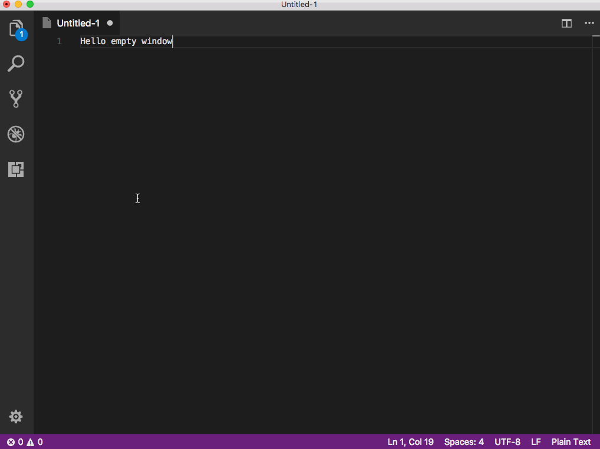

A new setting `window.restoreWindows` configures this behavior. The possible values are:

* `none` - to never restore any windows
* `one` - to restore the last active window (default)
* `folders` - to only restore opened folders
* `all` - to restore all windows.

With the new setting `window.restoreWindows`, we deprecated the previous setting `window.reopenFolders` and ask you to switch to the new setting. We still support the old setting for a couple of releases.

### Close unmodified files

A new command was introduced to close unmodified editors of the currently active editor group. This makes it easy to quickly dismiss tabs of editors that are not dirty. The action can be triggered not only via a keybinding (`kb(workbench.action.closeUnmodifiedEditors)`) but also from the context menu of tabs as well as the **OPEN EDITORS** view in the Explorer.


Thanks to [Soney Mathew (@soneymathew)](https://github.com/soneymathew) for providing the pull request for this feature!

### Switch window improvements

In a previous release, we added a quick picker for switching between the opened windows (via the `workbench.action.switchWindow` command). In this release, we did some tweaks to make the experience better.


You will now see icons for the currently active file or folder in the window, provided that you have enabled one of the File Icon themes.

In addition, a new command `workbench.action.quickSwitchWindow` was added to quickly switch between opened windows. Press and hold the modifier key to cycle through the list of windows and release all keys to open it.

As an example, to use this feature with the `Ctrl+R` keyboard shortcut, configure the following rule in the keybindings editor:

```json
{
    "key": "ctrl+r",
    "command": "workbench.action.quickSwitchWindow"
},
{
    "key": "ctrl+r",
    "command": "workbench.action.quickOpenNavigateNext",
    "when": "inWindowsPicker"
}
```

Press `Ctrl+R` and leave the `Ctrl` key pressed. As long as you now press the `R` key, you can navigate through the list of windows. Release all keys to focus it.

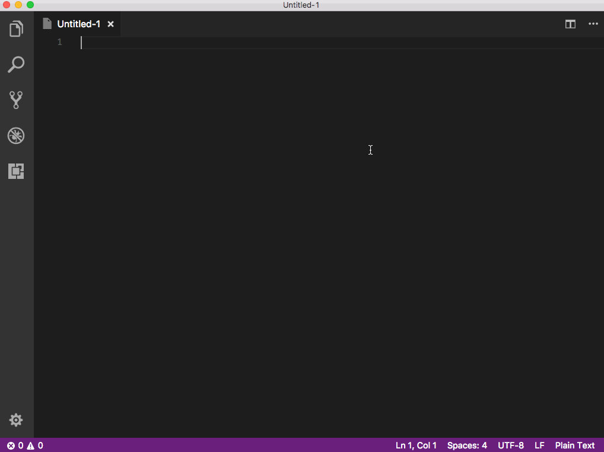

### New keybindings context per quick picker

Related to the improvements around the window picker, it is now easier and better to configure a picker with quick-pick functionality. Each time a picker opens, a specific keybinding context becomes active that you can use to assign keybindings to. For example, the window picker enables a context key `inWindowsPicker` when opened. Not only does it make quick navigate in pickers more powerful, it also fixes some annoying bugs. You can now bring up any quick picker, even if the quick picker is already showing (for example, opening the **Quick Open** file picker while the **Command Palette** is already open).

The following example demonstrates how to configure quick navigate keybindings to switch between the most recently opened folders:

As an example, to use this feature with the `Ctr+J` keyboard shortcut, configure the following rule in the keybindings editor:

```json
{
    "key": "ctrl+j",
    "command": "workbench.action.quickOpenRecent"
},
{
    "key": "ctrl+j",
    "command": "workbench.action.quickOpenNavigateNext",
    "when": "inRecentFilesPicker"
}
```

Press `Ctrl+J` and leave the `Ctrl` key pressed. As long as you now press the `J` key, you can navigate through the list of recently opened folders and files. Release all keys to open it.

### Lighter update experience

We're working on toning down the update experience. The consensus was that the popup message to update VS Code was disruptive and we are experimenting with other UI affordances. This month, you'll notice a little indicator in the bottom-left corner of the workbench when an update is available:

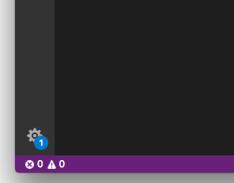

Clicking on this indicator will let you apply the update as well as access other global actions (**Command Palette**, **Settings**).

Don't worry about losing sight of this notification. macOS users will have the update automatically applied as soon as they restart VS Code and Windows and Linux users will get the old pop-up message if they don't notice the notification after a few days.

## Git

### Pull from specific remote

Thanks to @[BugraC](https://github.com/BugraC), @[matthewshirley](https://github.com/matthewshirley), @[Krzysztof-Cieslak](https://github.com/Krzysztof-Cieslak), it's now possible to pull changes from a specific branch in a remote repository.

### Manage your .gitignore file

[@BugraC](https://github.com/BugraC) also provided a change so that you can now add files to your `.gitignore` right from the context menu of the Source Control view or via the global **Git: Add File to .gitignore** command.

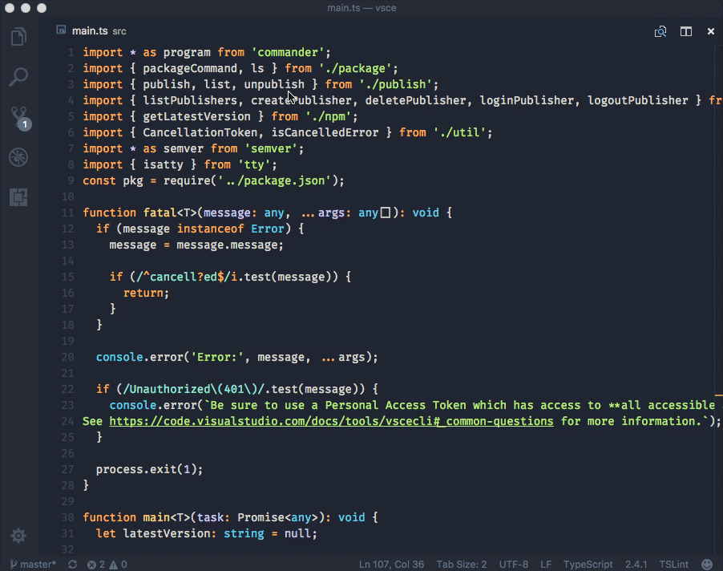

## Tasks

To make Tasks more convenient to use, we added a **Tasks** menu to the global menu bar:

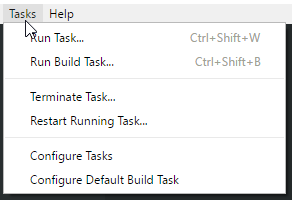

The **Tasks** menu offers a new action `Configure Default Build Task` which when used with the `0.1.0` version of a `tasks.json` file simply opens the `tasks.json` file. The full power of the **Tasks** menu comes when using it with the `2.0.0` version of the `tasks.json`, which is now the default if no `tasks.json` file is present.

Many cool features come with the new task format:

* The `Run Task` command now shows most recently used tasks first, then custom defined tasks, and last, auto detected tasks.
* Tasks are executed in the Integrated Terminal. This improves output encoding, brings full support for ANSI control sequences (for example, colors), and supports providing input to a task.
* Task auto detection for TypeScript, Gulp, Jake, Grunt and npm. We are working with extension providers to add dotnet, Maven and others in the future.
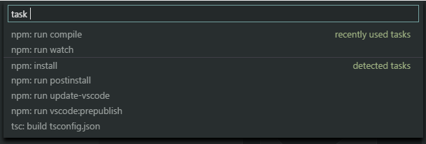
* Guided problem matcher selection when executing a task without one:
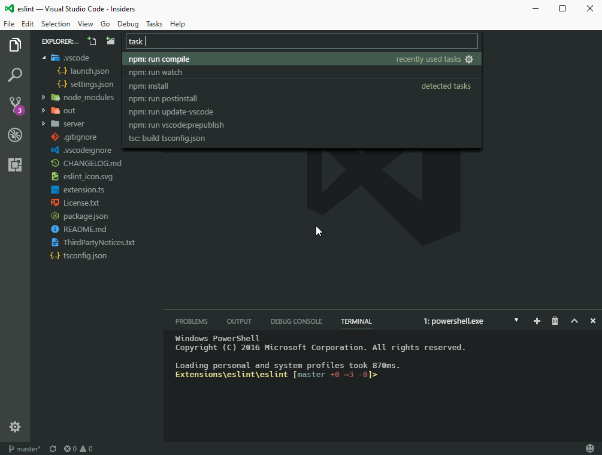
* Guided default build task selection. Simple run `Configure Default Build Task` from the global menu bar.
* And of course you can still define your own custom tasks in the `tasks.json` file with full control over how they are executed in the terminal. For example, the tasks below executes a test script in the terminal and uses a new terminal for every test run:

```json
{
    "version": "2.0.0",
    "tasks": [
        {
            "taskName": "Run tests",
            "type": "shell",
            "command": "./scripts/test.sh",
            "windows": {
                "command": ".\\scripts\\test.bat"
            },
            "group": "test",
            "presentation": {
                "reveal": "always",
                "panel": "new"
            }
        }
    ]
}
```

Please consult the [tasks documentation](https://code.visualstudio.com/docs/editor/tasks) for a detailed list of new features and how to use them as well as instructions on how to best convert a `0.1.0` version `tasks.json` file to a `2.0.0`.

We also released the tasks API. If you want to provide task detection for your programming language, you should definitely have a look at the [API](https://github.com/Microsoft/vscode/blob/master\src\vs\vscode.d.ts#L4790-L4791) and at one of the VS Code task detection extensions like [npm scripts autodetect](https://github.com/Microsoft/vscode/blob/master\extensions\npm\src\main.ts#L7-L8).

## Debugging

### Recipes for non-standard debugging scenarios

Setting up Node.js debugging can be challenging for some non-standard or complex scenarios. In May, we've started to collect recipes for these scenarios in a [recipe repository](https://github.com/weinand/vscode-recipes).

This release adds a new recipe by [Tony Sneed (@tonysneed)](https://github.com/tonysneed) for [Chrome Debugging with Angular CLI](https://github.com/weinand/vscode-recipes/blob/master/Angular-CLI).

### Debug hover has scroll bar for long values

Thanks to a community [pull request](https://github.com/Microsoft/vscode/pull/23211), debug hover now nicely displays long string values using a scroll bar.

## Node Debugging

### Windows executables are found even if no extension is specified

On Windows, it was previously necessary to include the correct file extension in the `runtimeExecutable` path which lead to this complicated cross platform solution:

```json
    "runtimeExecutable": "${workspaceRoot}/node_modules/.bin/nodemon",
    "windows": {
        "runtimeExecutable": "${workspaceRoot}/node_modules/.bin/nodemon.cmd"
    }
```

With this release, it is no longer necessary to include the file extension which makes the path portable across all platforms:

```json
    "runtimeExecutable": "${workspaceRoot}/node_modules/.bin/nodemon"
```

### Node.js v8.0 related changes

Different versions of Node.js support different debugging protocols. The VS Code Node.js debugger tries to determine automatically which protocol to use. If this is not possible, it defaults to the "legacy" protocol which is supported by all Node.js versions < 8.0. For details see the [Node.js Debugging documentation](https://code.visualstudio.com/docs/nodejs/nodejs-debugging#_supported-nodelike-runtimes). Since the adoption of Node.js v8.x is steadily increasing, we are in the process of changing the default protocol for specific scenarios from "legacy" to "inspector".

In this release, Node.js debugging will assume the "inspector" protocol whenever the `runtimeExecutable` attribute of a launch configuration is set. If you see your debug configurations failing, this change could be the reason. To fix this you can either upgrade Node.js to version 8.x or you can explicitly force the use of the "legacy" protocol by adding `"protocol": "legacy"` to your launch configuration.

### "attach" support for all Node.js versions

VS Code Node.js debugging always supported debugging a Node.js process even if it was not launched in debug mode. For this, the debug configuration of type "attach" has to specify a `processId` attribute. With this release, we support this feature for all versions of Node.js (and not only for versions < 8.0 as before).

## Extensions

### Installed / Recommended sections

To make recommended extensions more visible, **Extensions** view now shows **INSTALLED** and **RECOMMENDED** extensions in two sections.

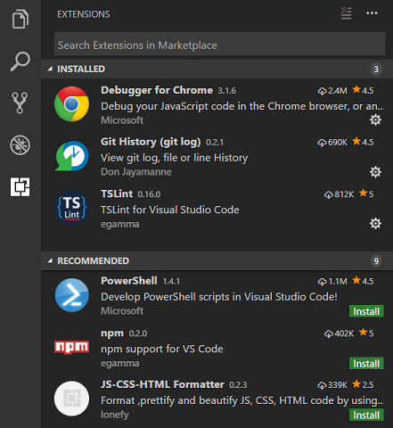

## Languages

### TypeScript 2.4

VS Code now ships with [TypeScript 2.4.1](https://blogs.msdn.microsoft.com/typescript/2017/06/27/announcing-typescript-2-4/). This release includes a number of new language features, bug fixes, and editor improvements. Some highlights include:

**Dynamic Import Expressions**

Support for the new ECMAScript `import` expression for lazily loading modules:

```ts
async function getZipFile(name: string, files: File[]): Promise<File> {
    const zipUtil = await import('./utils/create-zip-file');
    const zipContents = await zipUtil.getContentAsBlob(files);
    return new File(zipContents, name);
}
```

**Parent method suggestions in subclasses**

IntelliSense now displays interface and parent methods class methods in subclasses:


This is helpful for overriding parent methods or implementing interfaces.

**More relevant suggestions in JavaScript files**

In VS Code 1.13, suggestions in JavaScript files include suggestions for types:

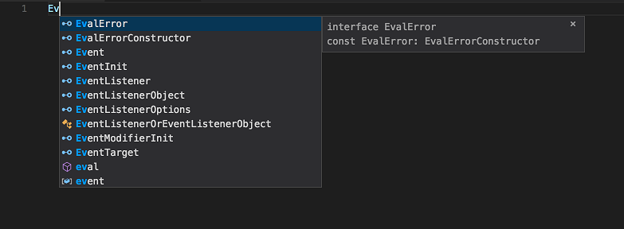

This meant that many suggestions that are generally not useful in JavaScript were shown, such as `EvalErrorConstructor` or `EventInit`.

VS Code 1.14 better filters JavaScript suggestions to only include those you typically care about while working in plain old JavaScript:


### Easier Building of TypeScript using Tasks

You can now build TypeScript projects using `kb(workbench.action.tasks.build)` without having to configure a `tasks.json` file, all you need is a `tsconfig.json` file:

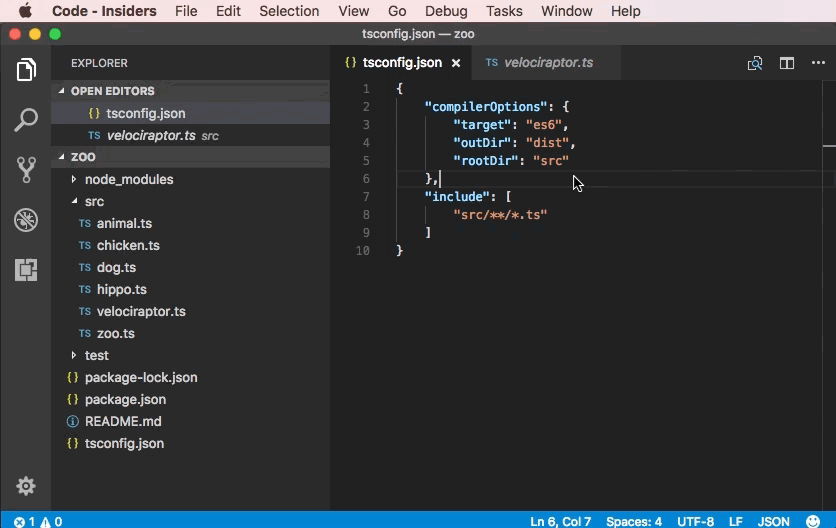

TypeScript will pick up all `tsconfig.json` projects in your workspace for building.

### Formatting option for spaces after TypeScript type assertions

The new `typescript.format.insertSpaceAfterTypeAssertion` setting allows you to control the placement of spaces after a type assertion in TypeScript.

```ts
// Default formatting
<Foo>{ abc: 123, ... };

// With "typescript.format.insertSpaceAfterTypeAssertion":true
<Foo> { abc: 123, ... };
```

### Preview of refactoring support for JavaScript and TypeScript

VS Code 1.14 includes initial support for refactoring JavaScript and TypeScript code. The first supported refactoring converts a JavaScript ES5-style function class to an ES6 class:

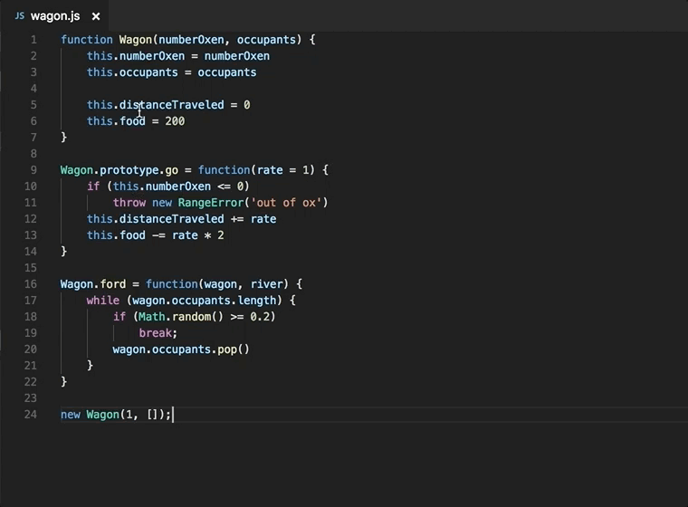

We plan to add additional refactorings in the future. 

### Control handling of line breaks in the markdown preview

The new `markdown.preview.breaks` setting controls the rendering of line breaks in the markdown preview. By default, single line breaks in markdown paragraphs and ignored:

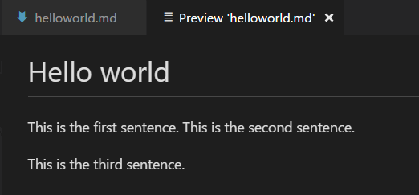

When `"markdown.preview.breaks": true` is set, all new lines in paragraphs are converted into `<br>` tags in the output html:

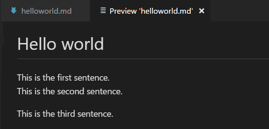


## Editor

### Improvements in Emmet features

In the previous release, we introduced a new model for Emmet features which you can enable by setting `emmet.useNewEmmet` to `true`. Below are the improvements to this new model in the current release.

**Multi cursor support in Emmet**

TODO: gif here

**Emmet customizations in the new Emmet model**

The new Emmet model supports the following Emmet settings:

- `emmet.includeLanguages`

   Get `Emmet: Expand Abbreviation` and `Emmet: Wrap with Abbreviation` to work in the language of your choice by providing a mapping in this setting. Use language ids for both sides of the mapping.
   For example:
    ```json
    "emmet.includeLanguages": {
        "javascript": "javascriptreact",
        "vue-html": "html",
        "plaintext": "jade"
    }
    ```

- `emmet.excludeLanguages`
    If there is any language where you do not want to see Emmet working, add it in this setting which takes an array of strings.

- `emmet.syntaxProfiles`
    See [Emmet Customization of output profile](https://docs.emmet.io/customization/syntax-profiles/#create-your-own-profile) to learn how you can customize the output of yur html abbreviations.
    For example:
    ```json
    "emmet.syntaxProfiles": {
        "html": {
            "attr_quotes": "single"
        },
        "jsx": {
            "self_closing_tag": true
        }
    }
    ```

- `emmet.variables`
    Customize variables used by Emmet snippets.
    For example:
    ```json
    "emmet.variables": {
        "lang": "de",
        "charset": "UTF-16"
    }
    ```

- `emmet.showExpandedAbbreviation`
    Control the Emmet suggestions that show up in the suggestion/completion list by updating this setting to
    Value | Description
    ----- | -----
    "never" | You will never see Emmet abbreviations in the suggestion list for any language
    "inMarkupAndStylesheetFilesOnly" | This is the default. You will see Emmet abbreviations in the suggestion list for languages that are markup and stylesheet related. `['html','pug','slim','haml','xml','xsl','css','scss','sass','less','stylus']`
    "always" | You will see Emmet abbreviations in the suggestion list in languages that are markup and stylesheet related  as well as `javascriptreact`, `typescriptreact` and any other language that has been mapped in the new setting `emmet.includeLanguages`.

    Note: In the "always" mode, the new Emmet is not context aware. For example: Say you are editing a JavaScript React file. You will get Emmet suggestions not only when writing markup but also while writing JavaScript.

**Enable language extensions to provide Emmet suggestions**

To get around the issue of having Emmet suggestions show up in the non-markup and non-stylesheet sections of your source code, we have pulled out the Emmet completion provider to a module of its own. This enables language extensions to pull in the npm module [vscode-emmet-helper](https://www.npmjs.com/package/vscode-emmet-helper) and provide Emmet suggestions in the right place as
they are more aware of the language structure than the Emmet extension.

## Accessibility

### Lists and quick pick leverage aria-setsize and aria-posinset

Lists such as the suggestion widget, exception list and the **Quick Open** dropdown now set `aria-setsize` and `aria-posinset`. These lists are virtualized and so without these [aria](http://www.w3.org/TR/wai-aria/) properties, the screen reader could not correctly determine the number of entries.

### Improved high contrast theme debugging

We have reacted on user feedback and improved some color contrasts in debugging for High Contrast theme.

## Extension Authoring

### Custom views

You can now control the visibility of a custom view by providing the `when` context value while defining it in `views` contribution section in `package.json`.

Example:

```json
"views": {
    "explorer": [
        {
            "id": "extension.node-debug.loadedScriptsExplorer",
            "name": "Loaded Scripts",
            "when": "inDebugMode && debugType == 'node'"
        }
    ]
}
```

### New Debug API

In this release, we've started to provide a [Debug API](https://github.com/Microsoft/vscode/issues/28500) for extensions.

The [initial API](https://github.com/Microsoft/vscode/issues/28234) covers the life-cycle of debug sessions:

* `createDebugSession` for starting a debug session based on an in-memory launch configuration.
* An `onDidTerminateDebugSession` event which indicates that a debug session has terminated.

> **Please note:** Currently this API is proposed, so in order to use it you must opt into it by adding a `"enableProposedApi": true` to `package.json` and you'll have to copy the [`vscode.proposed.d.ts`](https://github.com/Microsoft/vscode/blob/master/src/vs/vscode.proposed.d.ts) into your extension project. Also be aware that you cannot publish an extension to the Marketplace that uses the `enableProposedApi` attribute.

### Debug Adapter Protocol

**New capability `supportsDelayedStackTraceLoading`**

In the May release, we improved stepping performance by fetching parts of the call stack and the corresponding variables lazily. Later we learned that not all debug extensions were prepared to return the stack in chunks which could result in a [duplicated top stack frame](https://github.com/Microsoft/vscode/issues/28808). We couldn't find a way to fix this problem in a robust way, so we decided that debug adapters should opt-in to the delayed loading of stack frames explicitly and a new capability `supportsDelayedStackTraceLoading` was introduced in the debug protocol. So if the lazy loading of stack frames was working fine in your debug extension and if you know that your debug adapter already supports both the `startFrame` and the `levels` attribute of the `stackTrace` request, you should return `true` for the `supportsDelayedStackTraceLoading` capability. This ensures that you'll continue to see the improved stepping performance in the June release.

**New optional attribute `includeAll` for type `StackFrameFormat`**

With this the `StackTraceRequest` can be parameterized to include all stack frames, including those the debug adapter might otherwise hide.

## New Commands

Key|Command|Command id
---|-------|----------
`kb(workbench.action.closeUnmodifiedEditors)`|Close unmodified editors of the currently active editor group|`workbench.action.closeUnmodifiedEditors`
`kb(workbench.action.quickSwitchWindow)`|Quickly switch between opened windows|`workbench.action.quickSwitchWindow`
`kb(workbench.action.quickOpenRecent)`|Quickly switch between recently opened folders and files|`workbench.action.quickOpenRecent`

## Contributions to Extensions
* [PHP language server](https://github.com/felixfbecker/php-language-server): We completed a [pull request](https://github.com/felixfbecker/php-language-server/pull/357) to adopt the [Tolerant PHP Parser](https://github.com/Microsoft/tolerant-php-parser). Try it out in the [PHP IntelliSense](https://marketplace.visualstudio.com/items?itemName=felixfbecker.php-intellisense) extension.

## Thank You

Last but certainly not least, a big *__Thank You!__* to the following folks that helped to make VS Code even better:

Contributions to `vscode`:

* [Brandon Ruggles (@brandonrninefive)](https://github.com/brandonrninefive):  Fix for #29608 'QuickOpen looks misaligned in monokai theme'. [PR #29860](https://github.com/Microsoft/vscode/pull/29860)
* [Bugra Cuhadaroglu (@BugraC)](https://github.com/BugraC)
  *  Git: Pull from specific branch adds feature to #26738 [PR #26979](https://github.com/Microsoft/vscode/pull/26979)
  *  #23797 git manage ignore files [PR #29243](https://github.com/Microsoft/vscode/pull/29243)
* [@campersau](https://github.com/campersau):  cleanup duplicate semicolons in minimapCharRenderer [PR #28106](https://github.com/Microsoft/vscode/pull/28106)
* [Ernest Wong (@chewong)](https://github.com/chewong):  Added editor.urlClickable setting to enable/disable clickable URL [PR #28160](https://github.com/Microsoft/vscode/pull/28160)
* [Christopher Leidigh (@cleidigh)](https://github.com/cleidigh)
  *  Fix current output drop-down selected Issue #27643 [PR #27645](https://github.com/Microsoft/vscode/pull/27645)
  *  Add Debug Output Copy All command : Fixes #27079 [PR #28197](https://github.com/Microsoft/vscode/pull/28197)
* [@cristianhosu](https://github.com/cristianhosu):  #22622 [PR #23211](https://github.com/Microsoft/vscode/pull/23211)
* [traBpUkciP (@Duroktar)](https://github.com/Duroktar):  Open old version of file in Git side bar. [PR #26629](https://github.com/Microsoft/vscode/pull/26629)
* [Dustin Campbell (@DustinCampbell)](https://github.com/DustinCampbell):  Update C# TextMate grammar with latest fixes from csharp-tmLanguage [PR #28120](https://github.com/Microsoft/vscode/pull/28120)
* [Dmitry Zabello (@foreverest)](https://github.com/foreverest):  Multi root folders view name is not updated on removing … [PR #29596](https://github.com/Microsoft/vscode/pull/29596)
* [Georgios Andreadis (@gandreadis)](https://github.com/gandreadis):  Improve grammar of config setting description [PR #28957](https://github.com/Microsoft/vscode/pull/28957)
* [Rokas (@gecharo)](https://github.com/gecharo):  #10542 Ability to merge local git branches [PR #25731](https://github.com/Microsoft/vscode/pull/25731)
* [Hasan Ali (@hasali19)](https://github.com/hasali19):  Add options to theme notification buttons and badges [PR #28471](https://github.com/Microsoft/vscode/pull/28471)
* [Anton Vildyaev (@hun1ahpu)](https://github.com/hun1ahpu)
  *  Fix funny dot bug [PR #27966](https://github.com/Microsoft/vscode/pull/27966)
  *  Next group action should not create new group [PR #27967](https://github.com/Microsoft/vscode/pull/27967)
* [Ishan Arora (@ishanarora)](https://github.com/ishanarora):  fixes #22593 [PR #28816](https://github.com/Microsoft/vscode/pull/28816)
* [Jammerware (@jammerware)](https://github.com/jammerware):  Implement terminal rename action [PR #28464](https://github.com/Microsoft/vscode/pull/28464)
* [Jens Hausdorf (@jens1o)](https://github.com/jens1o)
  *  fix casing [PR #28087](https://github.com/Microsoft/vscode/pull/28087)
  *  add more settings to gear menu [PR #28303](https://github.com/Microsoft/vscode/pull/28303)
  *  Add `.rhtml` to html extension [PR #28028](https://github.com/Microsoft/vscode/pull/28028)
  *  fix some typos [PR #28101](https://github.com/Microsoft/vscode/pull/28101)
  *  remove double semicolons [PR #28110](https://github.com/Microsoft/vscode/pull/28110)
  *  update php grammar [PR #29130](https://github.com/Microsoft/vscode/pull/29130)
* [Jeremy Loy (@JeremyLoy)](https://github.com/JeremyLoy):  Added darwinHelpBook and darwinHelpName to build process for MacOS [PR #28654](https://github.com/Microsoft/vscode/pull/28654)
* [Kate Miháliková (@katemihalikova)](https://github.com/katemihalikova):  Handle diff3-style merge correctly [PR #27405](https://github.com/Microsoft/vscode/pull/27405)
* [Keegan Carruthers-Smith (@keegancsmith)](https://github.com/keegancsmith):  Filter settings from no search results link [PR #29261](https://github.com/Microsoft/vscode/pull/29261)
* [Krzysztof Cieślak (@Krzysztof-Cieslak)](https://github.com/Krzysztof-Cieslak)
  *  Add debugger type in extension view [PR #29214](https://github.com/Microsoft/vscode/pull/29214)
  *  Add `Git: Pull From` command [PR #29308](https://github.com/Microsoft/vscode/pull/29308)
  *  Add Support [line, col] in terminal links [PR #29212](https://github.com/Microsoft/vscode/pull/29212)
* [Matthew Shirley (@matthewshirley)](https://github.com/matthewshirley):  Add "pullFrom" git command [PR #26981](https://github.com/Microsoft/vscode/pull/26981)
* [@mbeatrizmagalhaes](https://github.com/mbeatrizmagalhaes):  Correct misspelled occurrences and occurred  [PR #28569](https://github.com/Microsoft/vscode/pull/28569)
* [Sam El-Husseini (@microsoftsam)](https://github.com/microsoftsam):  Turn autocomplete off on Mobile device keyboards [PR #27778](https://github.com/Microsoft/vscode/pull/27778)
* [Yu Zhang (@neilsustc)](https://github.com/neilsustc)
  *  Spaces in block comment. #28169 [PR #28238](https://github.com/Microsoft/vscode/pull/28238)
  *  Default Markdown language configuration [PR #28172](https://github.com/Microsoft/vscode/pull/28172)
* [Nick Snyder (@nicksnyder)](https://github.com/nicksnyder)
  *  Explicit return type on openResources [PR #28148](https://github.com/Microsoft/vscode/pull/28148)
  *  Only update viewlet switcher if it has already been rendered [PR #28568](https://github.com/Microsoft/vscode/pull/28568)
  *  Don't hardcode number of result providers [PR #28115](https://github.com/Microsoft/vscode/pull/28115)
* [@PeteX](https://github.com/PeteX):  Don't split words at U+2019, the right single quotation mark. [PR #28903](https://github.com/Microsoft/vscode/pull/28903)
* [Rohith Reddy Kumbharkar (@RohithKumbharkar)](https://github.com/RohithKumbharkar):  Fixes issue #28695 with tooltips in Activity Bar [PR #28783](https://github.com/Microsoft/vscode/pull/28783)
* [Soney Mathew (@soneymathew)](https://github.com/soneymathew):  Provide a command to close all unchanged files [PR #25692](https://github.com/Microsoft/vscode/pull/25692)
* [Tomáš Hübelbauer (@TomasHubelbauer)](https://github.com/TomasHubelbauer):  Add spaces and fix switch to actual MarkDown [PR #28696](https://github.com/Microsoft/vscode/pull/28696)
* [@WaiSiuKei](https://github.com/WaiSiuKei):  Add entry file of oniguruma when packing [PR #27123](https://github.com/Microsoft/vscode/pull/27123)

Contributions to `vscode-node-debug2`:
* [@rianadon](https://github.com/rianadon):  Stop debugging on program end [PR #112](https://github.com/Microsoft/vscode-node-debug2/pull/112)

Contributions to `vscode-languageserver-node`:

* [Sven Efftinge (@svenefftinge)](https://github.com/svenefftinge): Only convert `undefined` argument to null [PR #216](https://github.com/Microsoft/vscode-languageserver-node/pull/216)
* [Remy Suen (@rcjsuen)](https://github.com/rcjsuen): Fix typo in README.md [PR #219](https://github.com/Microsoft/vscode-languageserver-node/pull/219)

Contributions to `vscode-recipes`:

* [Tony Sneed (@tonysneed)](https://github.com/tonysneed): Add recipe for Chrome Debugging with Angular CLI [PR #2](https://github.com/weinand/vscode-recipes/pull/2)

<!-- In-product release notes styles.  Do not modify without also modifying regex in gulpfile.common.js -->
<a id="scroll-to-top" role="button" aria-label="scroll to top" href="#"><span class="icon"></span></a>
<link rel="stylesheet" type="text/css" href="css/inproduct_releasenotes.css"/>
