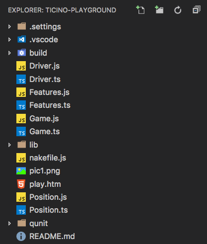
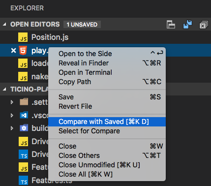
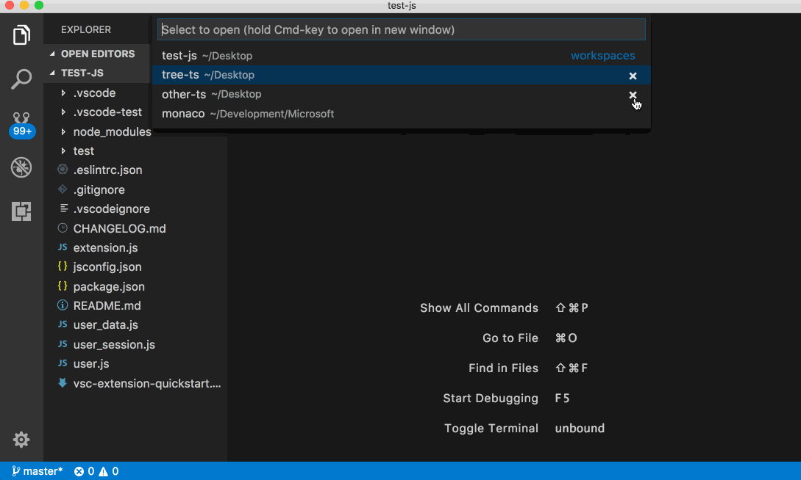
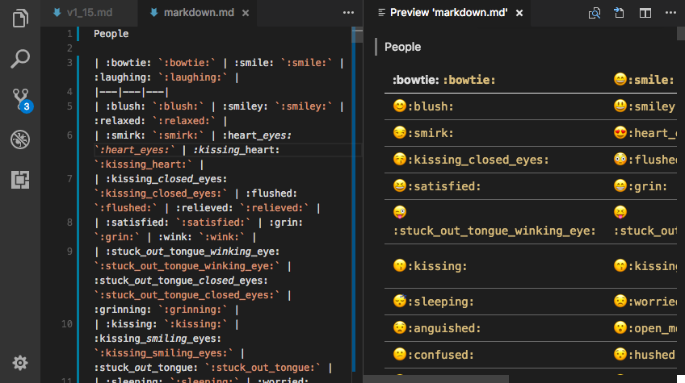
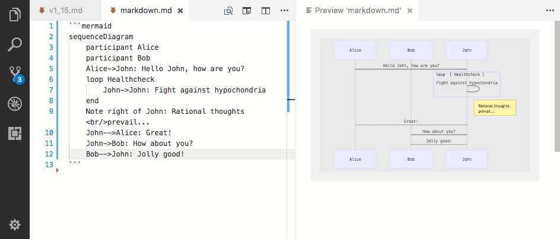
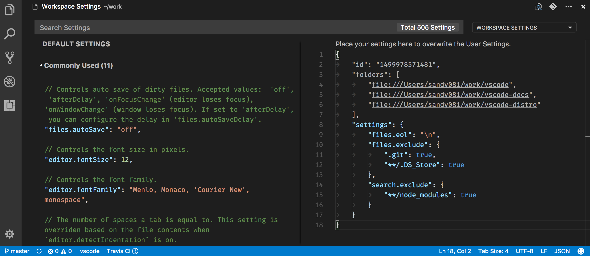
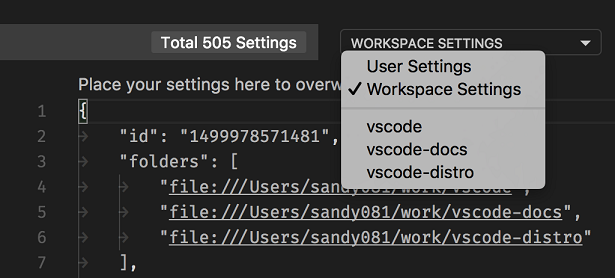
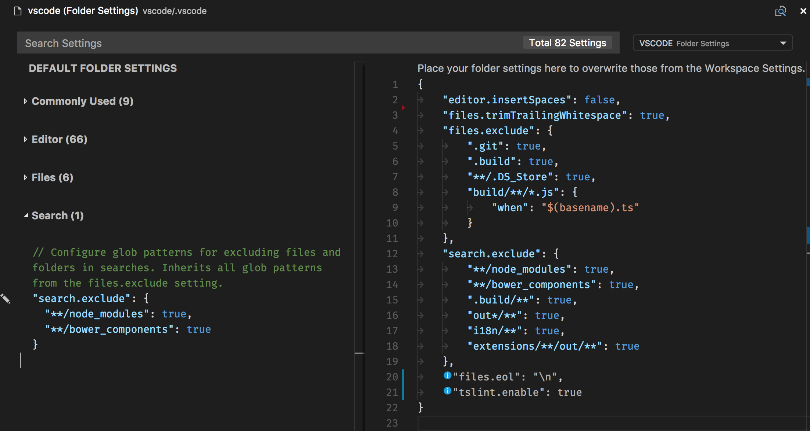

---
Order: 24
TOCTitle: July 2017
PageTitle: Visual Studio Code July 2017
MetaDescription: See what is new in the Visual Studio Code July 2017 Release (1.15)
MetaSocialImage: 1_15_release-highlights.png
---
# July 2017 (version 1.15)

## Insiders Release

Welcome to the Insiders build. These are the preliminary notes for the July 1.15 release of Visual Studio Code. As we get closer to the release date, you'll see details below about new features and important fixes.

Until the July release notes are available, you can still track our progress:

* **[July Iteration Plan](https://github.com/Microsoft/vscode/issues/30209)** - See what's planned for the milestone.
* **[Commit Log](https://github.com/Microsoft/vscode/commits/master)** - GitHub commits to the vscode open source repository.
* **[Closed bugs](https://github.com/Microsoft/vscode/issues?q=is%3Aissue+label%3Abug+milestone%3A%22July+2017%22+is%3Aclosed)** - Resolved bugs in the July milestone.
* **[Closed feature requests](https://github.com/Microsoft/vscode/issues?q=is%3Aissue+milestone%3A%22July+2017%22+is%3Aclosed+label%3Afeature-request)** - Implemented feature requests.

We really appreciate people taking a look at our new features as soon as they are ready so check back here often and learn what's new to try out.

If you find issues or have suggestions, you can enter them in the VS Code repository on [GitHub](https://github.com/Microsoft/vscode/issues).

## Windows 64 bit

Visual Studio Code 64 bit builds are now available on Windows for the Stable release! They come in the usual Setup Installer format as well as a ZIP archive. We will show a message box to guide you to install the 64 bit version on windows. Below are the download links:

Stable Windows 64 bit: [Installer](https://go.microsoft.com/fwlink/?linkid=852157) | [ZIP archive](https://go.microsoft.com/fwlink/?linkid=850641)

Insiders Windows 64 bit: [Installer](https://go.microsoft.com/fwlink/?linkid=852155) | [ZIP archive](https://go.microsoft.com/fwlink/?linkid=850640)

**Note:** If you are using the Setup Installer, you'll need to uninstall the 32 bit version before you install the 64 bit build. 

**Note:** All your settings and extensions will be preserved when you upgrade to the 64 bit version.

## Editor

### Large file support

Large files are always a great way to stress-test an editor. We currently use a line based representation of the text buffer, which has some serious advantages, but also disadvantages, especially in terms of memory consumption (for example, a file with very many short lines).

Any file that is over 30MB or over 300K lines will now be considered a large file and will be handled specially in some circumstances. By disabling certain features for large files, for example tokenization, line guides, and wrapping or folding, we were able to optimize memory usage, in some cases, by as much as 50%. Additionally, large files will never travel to our web worker, which computes diff information, link detection, or word based completions. This helps in reducing the memory pressure on the operating system.

Some of the optimizations will impact all files, although the effects should not be noticeable for small files. We decided to remove the hard-coded file size limit of 50MB on 64-bit installations and enforce a 300MB file size limit on 32-bit installations. Refer to [#30180](https://github.com/Microsoft/vscode/issues/30180) for more information about the different optimizations. 

### Support for snippet choices

With snippet choices, a placeholder can be prefilled with a set of values. The syntax is `${<number>|option_1,...,option_n|}`.

Below is a working sample specifying a fixed set of color choices:

```json
"color": {
  "prefix": "color",
  "body": "> Pick your favorite color ${1|red,green,blue,pink|}.\n< He likes $1."
}
```


Last but not least, when inserting snippets via IntelliSense a preview is now shown.

### Improved diff editor results

In this release, we made some changes to our diff algorithm to adjust the differences (which are found with the help of a Longest-Common-Substring algorithm) in such a way that they are more pleasing to the human eye.

In some cases, this means we will be more aligned with the output of `git diff` (which also incorporates some of these heuristics), but in other cases (like when only trim whitespace has changed), our result will no longer contain the LCS, so it will be different than `git diff`, but in our opinion it will also be more pleasing.

### Preview: Color Picker

We've introduced a color picker for color customizations in this release. It supports configuration of hue, saturation and opacity for the color that is picked up from the editor. It also provides the ability to trigger between different color modes by clicking on the color string at the top of the picker. The picker appears on a hover when you are over the color definition in a document.

​

For the preview, we enabled it for CSS, Sass and LESS files, supporting RGBA, HSLA and Hex color modes. We plan to extend the picker with more functionality as well as to enable extension authors to contribute their own color modes together with color definitions for their languages in future releases.

## Workbench

### Managing views

Now that VS Code supports custom views in the Explorer, it is useful to be able to customize their layout. With this release, you can now change the order and the visibility of the views in the:

* Explorer view
* Debug view
* Extensions view


You can drag and drop sections reorder and context menus allow you to hide and display sections. Changes to views are persisted across VS Code restarts.

### Search in Markdown preview

A PR from [Cody Hoover (@hoovercj)](https://github.com/hoovercj) brings search to webview contents, including the Release Notes, Markdown preview, and extension README pages:


### New setting to close window when last editor closes

There is a new setting `window.closeWhenEmpty` to control if the window (instance) should close when the last editor is closed. On macOS, it is typical application behavior that the instance should close when the last document is closed. If you want this behavior, you can enable the setting.

**Note**: The setting only has an impact for windows that have no folders opened.

### Improved --wait support

VS Code can be configured as the editor for external programs such as Git (see our [documentation](https://code.visualstudio.com/docs/editor/versioncontrol#_git-patchdiff-mode) ). For that purpose, the `--wait` command line argument is used to keep the VS Code instance open until the external program is closed. In this release, we re-implemented this feature to work around some known issues.

First of all, we will now remember which instance was opened with `--wait` and properly wait for that instance to close. This fixes annoying issues when `--wait` is used while VS Code is already running as well as when you open a first instance and then more windows afterwards without closing the first window. In addition, on macOS where closing a window typically does not quit the application, we are now also returning control to the process that started the instance once it gets closed.

Second, when you close the last editor of the instance that was opened with `--wait`, we will now close the window automatically. With that, you can just hit `kb(workbench.action.closeActiveEditor)` to close the window.

**Note**: If you always want to close the window when the last editor closes, check out the new `window.closeWhenEmpty` setting for empty windows.

### New theme color for title bar border

If you are on macOS, we show a custom title bar at the top. A new color `titleBar.border` can now be defined in themes or settings to draw a border separating the title bar from the rest of the editor.

### File Explorer sort order

Thanks to [Dmitry Zabello (@foreverest)](https://github.com/foreverest), a new setting `explorer.sortOrder` configures how files and folders are sorted in the File Explorer. You can choose between:

* `filesFirst` - Sort files before folders
* `mixed` - Sort files and folders without separation
* `modified` - Sort by last modified time
* `type` - Sort by file type

This is how the Explorer looks like with `explorer.sortOrder: mixed`



### Quick Open command with prefix

The existing command `workbench.action.quickOpen` can now receive a prefix as an argument to open the **Quick Open** picker with any text prefilled.

For example, you can configure a keybinding to bring up **Quick Open** with text prefilled like this:

```json
{ "key": "cmd+o", "command": "workbench.action.quickOpen", "args": "my-prefix" }
```

As an extension author, you can programmatically execute the command and pass in arguments:

```typescript
vscode.commands.executeCommand('workbench.action.quickOpen', 'my-prefix');
```

Thanks to [cristianhosu (@cristianhosu)](https://github.com/cristianhosu) for helping out with this.

### Compare dirty file with version on disk

Thanks to [Tobias Friemel (@tfriem)](https://github.com/tfriem), a new action compares a dirty (unsaved) file to its version on disk to quickly see the recent changes:



You can find the action from the context menu of dirty files within the **OPEN EDITORS** view of the Explorer and also as global command **Files: Compare Active File with Saved** (`kb(workbench.files.action.compareWithSaved)`).

### Font aliasing (macOS only)

A new setting `workbench.fontAliasing` was added (macOS) to control the font smoothing within the workbench and editor. By default, fonts are subpixel anti-aliased. Change the setting to `antialiased` to smooth the font on the level of the pixel, as opposed to the subpixel (this can make the font appear lighter overall). You can disable font smoothing if you set it to `none` (text will show with jagged sharp edges).

### Remove entries from recently opened

A new action (X) now shows up next to each entry of the recently opened picker (`kb(workbench.action.openRecent)`) to remove that entry from the list.



## Node.js Debugging

### Loaded Scripts Explorer

For the last few VS Code releases, it has been possible to search and open loaded scripts via the **Open Loaded Script** command, which used a simple [Quick Pick UI](https://code.visualstudio.com/updates/v1_11#_access-loaded-scripts).

In this release, we've added an Explorer to the Debug view that provides direct access to all scripts and updates automatically as more scripts are loaded by the runtime:


In contrast to the limited Quick Pick UI, the Explorer supports concurrent debug sessions and the scripts are grouped according to folders if used in a multi-root workspace.

A second advantage of the Loaded Scripts Explorer is that it was implemented as an extension and shows a real world example of the new debug API and how to contribute to a tree view. You can find the implementation [here](https://github.com/Microsoft/vscode-node-debug/blob/master/src/node/extension/loadedScripts.ts).

## Languages

### Linkifying in the markdown preview

The markdown preview will now automatically convert url-like text into clickable links. This feature can be disabled by setting `"markdown.preview.linkify": false`

## Extension Authoring

### New API for multi-root workspaces

New APIs have been added for multi-root workspaces. The "single root workspace" `workspace.rootPath` variable is now deprecated. Extension authors should use `workspace.workspaceFolders` which is a `WorkspaceFolder` array representing the current list of folders opened in the editor. There is a new event that fires when a folder is added or removed and a function `getWorkspaceFolder` to find a workspace folder for a given resource.

### Icon for root folders

Icon theme authors, please get ready for multi-root support: We added two new icon categories for VS Code: `rootFolder` and `rootFolderExpanded` that can be used to show root folders in a different way compared to other folders. For example, the File Explorer will use this icon as well as the list of recently opened workspaces.


### Configuration scopes

You can now classify the settings you contribute to `configuration` extension points into following scopes:

* `window`: Window specific configuration which can be applied to the VS Code window and can be configured in the User and Workspace settings.
* `resource`: Resource specific configuration, which can be applied to the resources like files and folders and can be configured in the User, Workspace and Folder settings.

```json
"configuration": {
  "type": "object",
  "title": "MyLint",
  "properties": {
    "mylint.enable": {
      "type": "boolean",
      "default": true,
      "description": "Control whether mylint is enabled for files or not.",
      "scope": "resource"
    }
  }
}
```

This classification is needed to configure settings impacting resources in a multi-root workspace through **[Configuration API](#configuration-api)**.

### Configuration API

The Configuration API is enhanced to support configuring settings at Global, Workspace and Folder levels in a multi-root workspace. Now you can ask for the configuration of a resource and inspect and update it in User, Workspace and Folder settings.

Here is an example of reading and writing the configuration of a resource in Folder settings in a multi-root workspace:

```typescript
const uri = vscode.window.activeTextEditor.document.uri;
const configuration = vscode.workspace.getConfiguration('mylint', uri);
// Let value of `mylint.enable` is `false` in the settings of root folder containing `uri`.
let value = configuration.get('enable'); // value is `false`
await configuration.update('enable', !value, vscode.ConfigurationTarget.WorkspaceFolder)
value = configuration.get('enable'); // value is `true`
```

**Note:** There are no breaking changes to the existing Configuration API.

### New API to open an editor or diff editor with a specific selection

We enriched the existing `TextDocumentShowOptions` with a new property `selection: Range` that can be used from the `showTextDocument` method as well as the `vscode.diff` command. When provided, the editor will reveal and select the provided range.

### Debug API updates

The proposed Debug API from last release (`vscode.debug.*`) has been slightly modified and extended.

Debugging can be started with the `startDebugging` function which takes either a named debug or compound configuration, or an in-memory configuration. Since named configurations or variables are only defined in the scope of a folder, we had to add a folder argument. A new `onDidStartDebugSession` event indicates that a debug session has been started.

The currently active debug session is available as the variable `activeDebugSession` and changes are reported through the `onDidChangeActiveDebugSession` event.

Custom Debug Adapter Protocol requests can be sent to a debug session with `DebugSession.customRequest` and corresponding custom events are reported through the `onDidReceiveDebugSessionCustomEvent` event.

### Debug Contributions

**Contributing views to the Debug Side Bar**

You can now contribute views to the Debug Side Bar.

```json
"contributes": {
  "views": {
    "debug": [
      {
        "id": "extension.node-debug.loadedScriptsExplorer",
        "name": "Loaded Scripts",
        "when": "inDebugMode && debugType == 'node'"
      }
    ]
  }
}
```

**Variable substitution in _package.json_ will no longer be supported**

We are planning to stop support for variable substitution in the `program` and `runtime` attributes of the `debuggers` contribution in `package.json`. The reason for this is twofold: first, it is hard to explain that variable substitution only works for two attributes and not for all attributes in `package.json`. Second, with multi-root folders, it is difficult to support this feature in a useful way.

We will deprecate variable substitution in this release and plan to drop the feature in August. If it is difficult for you to move off this feature, please speak up by commenting [here](https://github.com/Microsoft/vscode/issues/31675).

### Debug Adapter Protocol

**New `process` event**

A new `process` event has been added that conveys the process ID and other information about the process being debugged.

**New enum value `normal` for `presentationHint` attribute**

For completeness, the default value `normal` was added to the value set for the `presentationHint` attribute of type `Source`.

### New API to extend the markdown preview

Extension authors can now extend the markdown preview. The new API offers [three new contribution points](docs/extensionAPI/api-markdown.md):

**Preview Styles**

Extensions can contribute CSS to customize the look or layout of the markdown preview:


**Markdown It Plugins**

Extensions can add support for additional markdown syntax by contributing a [markdown-it plugin.](https://github.com/markdown-it/markdown-it#syntax-extensions):



**Preview Scripts**

Finally, for advanced functionality, extensions may contribute scripts that are executed inside of the markdown preview:



## Preview: Multi Root Workspaces

We continued working on support for opening multiple folders in a single VS Code window (instance) ([issue #396](https://github.com/Microsoft/vscode/issues/396)). There was a preview of this feature in our last release (see [1.14.0 release notes](https://code.visualstudio.com/updates/v1_14#_preview-multi-root-workspaces)). Multi-root functionality is  only available in the Insiders build until we are confident enough that we can make it available in Stable. To try it out, grab our Insiders build from [https://code.visualstudio.com/insiders](https://code.visualstudio.com/insiders).

During this sprint, we focused on making multi-root workspaces a first class concept.

### Workspace

A Workspace is a new concept that surfaces in the UI whenever you want to have multiple folders opened in a single window (instance). A workspace is a simple configuration file that describes the folders you want to have open in a window. For example, for VS Code development we typically use three folders very frequently:


As you can see from the screenshot above, the workspace configuration file also contains a section for settings. Any **Workspace Setting** that you configure will end up in this file too (see below for more details around Workspace Settings).

Once you add additional folders to an empty window or a single-folder window, we make this window into an "Untitled Workspace". A window reload is currently required for this transition (see video below). In the future, we think that we can make this transition even smoother without a window reload.


### Untitled Workspace

As long as you do not save a workspace, it will appear as an "Untitled Workspace". We do not force you to save a workspace until you want to have it in a permanent location, for example, on your Desktop. Untitled workspaces are present as long as the window they are using is open. Once you close a window with an untitled workspace, we will ask you to save it if you plan to open it again in the future:


### Saved Workspaces

Saved Workspaces can be opened by double clicking the `.code-workspace` file or via the new **Open Workspace...** command under the **File** menu:


You will also see a new action **Save Workspace As...** that allows you to save the workspace to any location on your disk. The file extension of a VS Code workspace is `.code-workspace` and in the future, we plan to make it easier to share these files by allowing relative paths for folders.

Workspaces show up in a similar way as folders. You can open them from the list of recently opened workspaces:


Any workspace will have an extra `(Workspace)` suffix appended to the name.

### Workspace Settings

As mentioned above, the new Workspace concept introduces a workspace configuration file that contains a section to configure your workspace settings. In a multi-root workspace, when you open workspace settings, we now show this file. This file also contains other sections which are not related to workspace settings. To make them less prominent, we dim them in the editor. In future, we would improve the experience by showing only the settings section just like in User settings.



### Folder Settings

With multiple root folders in one workspace, it is possible to have a `.vscode` folder in each root folder defining the settings that should apply for that folder. You can open the folder settings in the Settings editor from the drop-down.



Selecting the folder, opens the settings for that folder.



Only `resource` specific settings are applied at Folder level and `window` specific settings are not. Default settings editor on the left shows only those settings that can be applied at Folder level. If `window` specific settings exist in Folder settings, then they are shown dimmed with an info icon.


Refer to **[Settings classification](#configuration-scopes)** to know about window and resource specific settings.

### Multi-root debugging

With the continuing work on multi-root workspaces, we have adapted debugging to the new multi-root world. When opening a workspace with multiple `launch.json` files, we now show all the configurations in the Debug drop-down. Each configuration will get its variables resolved (for example `${workspaceRoot}`) relative to the folder it belongs to.


## New Commands

Key|Command|Command id
---|-------|----------
`kb(workbench.files.action.compareWithSaved)`|Compare a dirty file with the version on disk|`workbench.files.action.compareWithSaved`
`kb(workbench.action.terminal.deleteWordLeft)`|Delete word left in terminal|`workbench.action.terminal.deleteWordLeft`
`kb(workbench.action.terminal.deleteWordRight)`|Delete word right in terminal|`workbench.action.terminal.deleteWordRight`

## Thank You

Last but certainly not least, a big *__Thank You!__* to the following folks that helped to make VS Code even better:

Contributions to `vscode`:

Contributions to `vscode-node-debug`:

* [Gary Ewan Park (@gep13)](https://github.com/gep13): (typo) Minor correction [PR #154](https://github.com/Microsoft/vscode-node-debug/pull/154)

Contributions to `vscode-node-debug2`:

Contributions to `vscode-languageserver-node`:

Contributions to `vscode-extension-vscode`:

Contributions to `vscode-tslint`:

* [David Valachovic (@AdenFlorian)](https://github.com/AdenFlorian)
  * When autoFixOnSave is array, items must be strings [PR #232](https://github.com/Microsoft/vscode-tslint/pull/232)
  * Allows naming which quick fixes should be run on save [PR #231](https://github.com/Microsoft/vscode-tslint/pull/231)

Contributions to `vscode-debugadapter-node`:

* [Holger Benl (@hbenl)](https://github.com/hbenl): testsupport: add missing requests to DebugClient [PR #120](https://github.com/Microsoft/vscode-debugadapter-node/pull/120)

Contributions to `vscode-recipes`:

* [Cyril DURAND (@cyrildurand)](https://github.com/cyrildurand): Update README.md [PR #13](https://github.com/weinand/vscode-recipes/pull/13)

<!-- In-product release notes styles.  Do not modify without also modifying regex in gulpfile.common.js -->
<a id="scroll-to-top" role="button" aria-label="scroll to top" href="#"><span class="icon"></span></a>
<link rel="stylesheet" type="text/css" href="css/inproduct_releasenotes.css"/>
