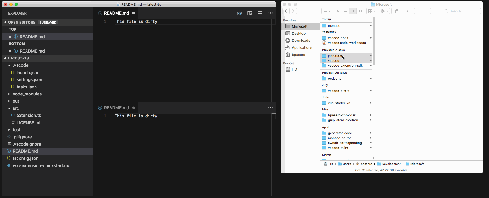
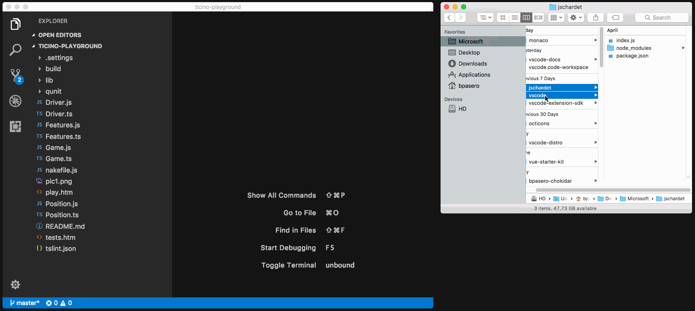

---
Order: 25
TOCTitle: August 2017
PageTitle: Visual Studio Code August 2017
MetaDescription: See what is new in the Visual Studio Code August 2017 Release (1.16)
MetaSocialImage: 1_16_release-highlights.png
---
# August 2017 (version 1.16)

## Insiders Release

Welcome to the Insiders build. These are the preliminary notes for the August 1.16 release of Visual Studio Code. As we get closer to the release date, you'll see details below about new features and important fixes.

Until the August release notes are available, you can still track our progress:

* **[August Iteration Plan](https://github.com/Microsoft/vscode/issues/32043)** - See what's planned for the milestone. 
* **[Commit Log](https://github.com/Microsoft/vscode/commits/master)** - GitHub commits to the vscode open source repository.
* **[Closed bugs](https://github.com/Microsoft/vscode/issues?q=is%3Aissue+label%3Abug+milestone%3A%22August+2017%22+is%3Aclosed)** - Resolved bugs in the August milestone.
* **[Closed feature requests](https://github.com/Microsoft/vscode/issues?q=is%3Aissue+milestone%3A%22August+2017%22+is%3Aclosed+label%3Afeature-request)** - Implemented feature requests.

We really appreciate people taking a look at our new features as soon as they are ready so check back here often and learn what's new to try out.

If you find issues or have suggestions, you can enter them in the VS Code repository on [GitHub](https://github.com/Microsoft/vscode/issues).

## Workbench

### Open a folder via drag and drop

VS Code has always supported dragging a folder from outside VS Code into it to open the folder. VS Code stills support this, but the visual feedback is changed a little bit. Previously you could drop the folder anywhere in VS Code to open it. With this release, you need to drop the folder over the editor area to open it. This change is due to both a technical reason (an Electron update) as well as an explicit decision to make the multi-root experience better. If you are using VS Code Insiders with multi-root support, you will be happy to hear that you can now drop a folder into the File Explorer to add it to the workspace.


### Drag and drop from Search results and Problems panel

You can now drag files from the Search results and Problems panel over the editor area to control where these should open. The Files Explorer always supported this and we have now expanded that feature to more areas.


### New icons

There is a new Visual Studio Code application logo (TODO@Chris).

### Theming improvements

Several new theming color keys were introduced. These colors can be set by themes or directly by the user with the `workbench.colorCustomizations` setting:

Key|Description
---|-------
`tab.activeBorder`|A border drawn to the bottom of the active tab.
`tab.unfocusedActiveBorder`|A border drawn to the bottom of the active tab in an editor group that is not focused.

See [Theme Color Reference](https://code.visualstudio.com/docs/getstarted/theme-color-reference) for a complete list of colors.

Markers in the overview ruler (Minimap) now use the same theme color as the correspond text.

## Languages

### HTML

Tag elements are now automatically closed when `>` of the opening tag is typed:


The matching closing tag is inserted when `/` of the closing tag is entered:


The new behavior is enabled by default and can be turned off with setting `html.autoClosingTags`

Thanks to [Jun Han](https://github.com/formulahendry) for leading the way with his [auto-close extension](https://marketplace.visualstudio.com/items?itemName=formulahendry.auto-close-tag). Note that the auto-close extension has more features, in particular, it can be enabled for languages other than HTML as well.

## Extension Authoring

### Profile Your Extension

You can now profile extensions using Chrome DevTools. Do the following:

1. Start VS Code from the command line the with `--inspect-extensions=<port>`-flag, for example `code --inspect-extensions=9333`.
2. In VS Code, from the **Command Palette** (`F1`), select **Developer: Toggle Developer Tools**, hit `Enter`.
3. Select the **Console** tab and find a message that starts with `"Debugger listening on port 9333"` and that ends with a `chrome-devtools`-link.
4. Open that link in Chrome for dedicated DevTools for the extension host.
5. Use the CPU and Memory profiler to understand how memory and compute is being used.

### Tooltip for source control resource decorations

Thanks to [@marckassay](https://github.com/marckassay), you can now have [tooltips on source control resource decorations](https://github.com/Microsoft/vscode/pull/29644).

<!-- In-product release notes styles.  Do not modify without also modifying regex in gulpfile.common.js -->
<a id="scroll-to-top" role="button" aria-label="scroll to top" href="#"><span class="icon"></span></a>
<link rel="stylesheet" type="text/css" href="css/inproduct_releasenotes.css"/>

### Themable colors in extensions

Extension can now contribute new themable colors. These colors can be used in decorators and in the Status Bar.

```json
  "colors": [{
      "id": "superstatus.error",
      "description": "Color for error message in the status bar.",
      "defaults": {
          "dark": "errorForeground",
          "light": "errorForeground",
          "highContrast": "errorForeground"
      }
  }]
```

Once defined, user can customize the color in the `workspace.colorCustomization` setting. User themes can set the color value.

## Preview: Multi Root Workspaces

>**Note:** Multi-root functionality is only available in the Insiders build until we are confident enough that we can make it available in Stable. To try it out, grab our Insiders build from [https://code.visualstudio.com/insiders](https://code.visualstudio.com/insiders).

We continued working on support for opening multiple folders in a single VS Code window (instance) ([issue #396](https://github.com/Microsoft/vscode/issues/396)). There was a preview of this feature in our last releases (see [1.14.0 release notes](https://code.visualstudio.com/updates/v1_14#_preview-multi-root-workspaces) and [1.15.0 release notes](https://code.visualstudio.com/updates/v1_14#_preview-multi-root-workspaces)).

During this milestone, we focused on updating extensions to be ready for multi-root workspaces and source control support. We also revisited the workspace file format and made the UI transition into multi-root workspaces more pleasant.

### New workspace file format

The contents of the workspace file (`*.code-workspace`) was changed during this sprint. You do not have to worry about existing workspace files, they will be migrated to the new format automatically!

A new workspace file now looks like this:

```json
{
  "folders": [
    {
      "path": "monaco"
    },
    {
      "path": "Projects/vscode-distro"
    },
    {
      "path": "vscode-docs"
    },
    {
      "path": "/Users/bpasero/Development/Microsoft/vscode-extension-sdk"
    }
  ]
}
```

As you can see, the `id` property is no longer part of the file. Instead, the location of the workspace file on disk is used to derive an identifier for the workspace. We use this identifier to associate various items with the workspace:

* All UI state (for example, opened editors)
* Dirty (unsaved) files (for Hot Exit)
* Extension storage

One advantage of this change is that you can now simply copy the workspace file on disk to open the same workspace into multiple windows.

Another change was done on the `folders` property: each entry is now an object which gives us the possibility of adding additional metadata to folders in the future. We also went away from using file resources as the format for the folder paths and now simply use paths.

Finally, we support relative paths in the workspace file! A relative folder path will be resolved against the folder where the workspace file is stored. We automatically store a path as relative if we detect that the location of the workspace file is a parent of the folder. Otherwise the absolute path will be used.

### Smooth transition into multi-root workspaces

There are several ways to turn an empty workspace or single-folder workspace into a multi-root workspace. The transition used to be a bit rough, for example, it was not possible transition with unsaved files. In addition, all the UI state was lost when you created a multi-root workspace. In this milestone, we made the behavior a lot smoother. We still require a window reload, but we have plans to get rid of that step to make the transition fast.

In the animation below you can see how a single-folder window turns into a multi-root workspace. A couple of things happen:

* All UI state is migrated into the workspace and restored (vertical editor layout and opened editors).
* All dirty (unsaved) files are properly restored and you are not prompted to save.
* Workspace settings are copied over into the multi-root workspace (hidden Status Bar, hidden Activity Bar)



### More ways to create a multi-root workspace

We expanded the ways to create a multi-root workspace in VS Code.

#### Command line

There is a new command line argument `--add`. Use it to add folders on the command line to the currently active window. The new folder argument should be provided as a path. This works for an empty workspace, a single-folder workspace, as well as an existing multi-root workspace.

If you provide multiple folders to open from the command line, we used to open each folder in a separate window. Now, we automatically create a workspace for you and open all folders into a single window.

#### Drag and drop

If you drop folders into VS Code, we used to open each folder into a separate window. With multi-root support, we now open all folders into one window by creating a workspace for you automatically. In addition, you can now drop folders into the File Explorer to add them to the workspace.



#### Native controls

Finally, when you pick multiple folders from the native file dialog (via **File** > **Open**), we will open all folders at once into a workspace. The same is true when you drop multiple folders onto the application icon in the dock on macOS.

### Updates for multi-root workspaces

The following built-in languages have been updated to support folder specific settings in a multi-root workspaces setup: CSS, Sass (SCSS), Less, JSON, and HTML.

## Notable Changes

* [931](https://github.com/Microsoft/vscode/issues/931): Windows: Cannot save hidden files
* [32550](https://github.com/Microsoft/vscode/issues/32550): Explorer: allow to collapse a sub-tree fully via Alt-click
* [6196](https://github.com/Microsoft/vscode/issues/6196): VSCode is not per monitor DPI aware
* [29119](https://github.com/Microsoft/vscode/issues/29119): Support files.eol as multi root folder setting

## Thank You

Last but certainly not least, a big *__Thank You!__* to the following folks that helped to make VS Code even better:

Contributions to `vscode-css-languageservice`:

* [Praveen Puglia (@praveenpuglia)](https://github.com/praveenpuglia):  browser support updates to some properties [PR #41](https://github.com/Microsoft/vscode-css-languageservice/pull/41)