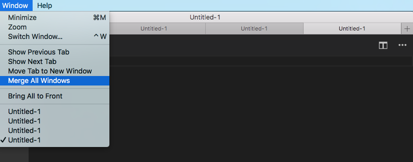
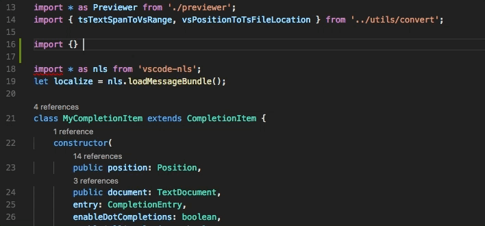
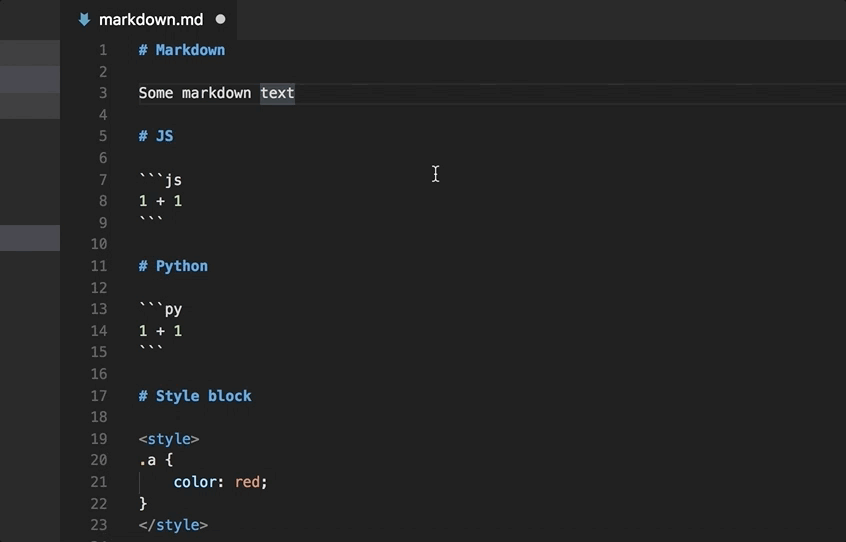

# September 2017  (version 1.17)

## Insiders Release

Welcome to the Insiders build. These are the preliminary notes for the September 1.17 release of Visual Studio Code. As we get closer to the release date, you'll see details below about new features and important fixes.

Until the September release notes are available, you can still track our progress:

* **[September Iteration Plan](https://github.com/Microsoft/vscode/issues/34160)** - See what's planned for the milestone.
* **[Commit Log](https://github.com/Microsoft/vscode/commits/master)** - GitHub commits to the vscode open source repository.
* **[Closed bugs](https://github.com/Microsoft/vscode/issues?q=is%3Aissue+label%3Abug+milestone%3A%22September+2017%22+is%3Aclosed)** - Resolved bugs in the September milestone.
* **[Closed feature requests](https://github.com/Microsoft/vscode/issues?q=is%3Aissue+milestone%3A%22September+2017%22+is%3Aclosed+label%3Afeature-request)** - Implemented feature requests.

We really appreciate people taking a look at our new features as soon as they are ready so check back here often and learn what's new to try out.

If you find issues or have suggestions, you can enter them in the VS Code repository on [GitHub](https://github.com/Microsoft/vscode/issues).

## Workbench

### macOS Touch Bar support

There is now support for showing actions in the macOS touch bar. Out of the box we add actions to navigate in editor history as well as the full debug tool bar to control the debugger:


Extensions can add commands to the touch bar as well via the new `touchBar` menu identifier. See below under [Extension Authoring](#extension-authoring) for more details.

### Better macOS native window tabs support

You can enable native window tabs on macOS (Sierra) with the `"window.nativeTabs": true` setting. In this milestone, we made working with native tabs easier.



For one, you will now find a "+" action next to the last tab to open a new window as tab. We also added the typical actions to the window menu for managing tabs.

### Better --wait support

VS Code can be started with the `--wait` argument from the command line to wait until the instance that opens is closed. In this milestone, we made this feature more powerful by also terminating the calling process when all of the editors are closed that got opened. As a consequence, you can now use `--wait` with instances that are already opened, making this a much faster experience.


**Note**: By default, we will now reuse any opened instance. To avoid that, add the `-n` argument to the command line.

### New features around file encoding

It is now possible to configure the `files.encoding` as well as `files.autoGuessEncoding` setting per language. VS Code also now supports CP 850 and CP 865 encoding.

### New setting to control editor labels

A new setting, `workbench.editor.labelFormat`, adjusts the default label for editors. Possible values are `short`, `medium`, `long` and `default`. By default, editors will only show information about the file path when multiple editors with the same name are opened. If any of the other options is used, the editor label will always show path information.


## Editor

### Disable editor lightbulbs

The new `editor.lightbulb.enabled` setting enables or disables the code action light bulb in the editor. The default value is `true`.

### Improved history navigation

VS Code has commands to navigate within the editor history (`workbench.action.navigateBack`, `workbench.action.navigateForward`), either across or within files. During this milestone, we tweaked the experience to produce less unwanted stops in history:

* We now require a minimum distance of 10 lines from one selection to another to add a new entry to history (previously we required a distance of 5 lines).
* Navigating less than 10 lines replaces the last history stop within the file with that location and thus avoids introducing unwanted stops.

In addition, we no longer center the selection vertically when navigating unless the selection is outside of the view. This makes it easier to stay in context while navigating around.

## Languages

### TypeScript 2.5.3

VS Code now includes TypeScript 2.5.3. This updates brings a few important fixes and improvements, with a focus on the extract method refactoring.

### Extract method now triggers rename

The extract method and extract function refactoring for JavaScript and TypeScript will now automatically trigger a rename on the extracted method or function.

### Auto detection of TypeScript watch build tasks

TypeScript now automatically creates watch tasks for `tsconfig.json` files in a project, along with the normal build tasks:


### JavaScript and TypeScript IntelliSense now supports Markdown

Suggestions and parameter hints for JavaScript and TypeScript can now render Markdown content.


### Import path quick suggestions in JavaScript and TypeScript

JavaScript and TypeScript have provided IntelliSense for import paths ever since VS Code 1.9. However, you may not have known about this feature because it required manually triggering IntelliSense while typing the import. With VS Code 1.17, we now automatically show module and path suggestions as soon as you start typing an `import` or `require` path:



### Improvements to JSX language scoping

JavaScript expressions inside of JSX tags now are correctly marked as being of the JavaScript language. This fixes a number of bugs around basic language features such as bracket matching and code commenting.

### Language support in Markdown code blocks

Fenced code blocks in Markdown files now set the language mode for their contents. This means that basic language features such as bracket matching and code commenting now use the settings for the fenced code block's language rather than the generic Markdown language settings:



### Detection of Markdown reference links

Reference links and reference link definitions are now detected as links in the editor:

```md
Some text with a [link][link definition] in it

[link definition]: /path/to/link
```

Clicking on `link definition` will jump to `[link definition]:`. `/path/to/link` is now also detected as a link.

### Improved colorization in Dark+ and Light+ themes

VS Code's built-in Dark+ and Light+ themes now highlight regular expression components so that they can be more easily identified:


Colorization of format strings and string interpolation has also been improved for a few languages.

Python:


Ruby:


## Extension Authoring

### File Save & File Open Dialog

The extension API has two new functions that allow extensions to show dialogs for saving and opening files or folders. The snippet below will show an open dialog that allows to select multiple image-files.

```ts
vscode.window.showOpenDialog({
    canSelectMany: true,
    filters: { 'Images': ['png', 'jpg'] }
}).then(result => {
    if (result) {
        console.log(`${result.length} files have been seleced`);
    }
});
```

### Touch Bar Support

Extensions can now contribute commands to the touch bar on macOS. A new menu identifier `touchBar` was added for this purpose:

```json
"contributes": {
  "menus": {
    "touchBar": [
      {
        "command": "markdown.showPreview",
        "when": "editorLangId == markdown",
        "group": "navigation"
      }
    ]
   }
}
```

The command context is always the currently active file making it possible to show and hide the command dynamically based on the `when` condition. It can either have a label or an icon. If the command provides an icon, the label will not be shown because the space is very limited in the touch bar.

**Note**: We currently require the commands icon to be of PNG file type. SVG is not supported.

### CompletionContext

`CompletionItemProvider.provideCompletionItems` now is provided with a new `CompletionContext` parameter. This context contains information about how the completion provider was triggered:

```ts
interface CompletionContext {
  /**
    * How the completion was triggered.
    */
  readonly triggerKind: CompletionTriggerKind;

  /**
    * Character that triggered the completion item provider.
    * `undefined` if provider was not triggered by a character.
    * The trigger character is already in the document when the completion provider is triggered.
    */
  readonly triggerCharacter?: string;
}
```

## Preview: Multi Root Workspaces

>**Note:** Multi-root functionality is only available in the Insiders build until we are confident enough that we can make it available in Stable. To try it out, grab our Insiders build from [https://code.visualstudio.com/insiders](https://code.visualstudio.com/insiders).

We continued working on support for opening multiple folders in a single VS Code window (instance) ([issue #396](https://github.com/Microsoft/vscode/issues/396)). There was a preview of this feature in our last releases (see [1.14.0 release notes](https://code.visualstudio.com/updates/v1_14#_preview-multi-root-workspaces), [1.15.0 release notes](https://code.visualstudio.com/updates/v1_15#_preview-multi-root-workspaces) and [1.16.0 release notes](https://code.visualstudio.com/updates/v1_16#_preview-multi-root-workspaces)).

During this milestone, we focused on making the transition into a workspace work without a window reload and introduced more APIs for extensions to better support multi-root workspaces.

### Enter a workspace without window reload

Previously we required a full window reload when creating or saving workspaces or when adding folders to a workspace. We no longer require this window reload making the multi-root experience a lot smoother.

### New API: Workspace Folder Picker

With the advent of multi-root support in VS Code, we noticed that often an extension wants to ask the user for a specific `WorkspaceFolder`. The new proposed API method `showWorkspaceFolderPick` opens a picker and returns the result.


### New API: RelativePattern

To make it easier to filter file paths to a specific `WorkspaceFolder`, we added a new type `RelativePattern` and support it in the following places:

* `workspace.createFileSystemWatcher`
* `workspace.findFiles(include, exclude)`
* `DocumentFilter#pattern`

The type is a class as follows:

```typescript
/**
 * A relative pattern is a helper to construct glob patterns that are matched
 * relatively to a base path. The base path can either be an absolute file path
 * or a [workspace folder](#WorkspaceFolder).
 */
class RelativePattern {

  /**
   * A base file path to which this pattern will be matched against relatively.
   */
  base: string;

  /**
   * A file glob pattern like `*.{ts,js}` that will be matched on file paths
   * relative to the base path.
   *
   * Example: Given a base of `/home/work/folder` and a file path of `/home/work/folder/index.js`,
   * the file glob pattern will match on `index.js`.
   */
  pattern: string;

  /**
   * Creates a new relative pattern object with provided base path and pattern to match.
   *
   * @param base A base file path to which this pattern will be matched against relatively.
   * @param pattern A file glob pattern like `*.{ts,js}` that will be matched on file paths
   * relative to the base path.
   */
  constructor(base: WorkspaceFolder | string, pattern: string)
}
```

You can create a relative pattern via the following call:

```typescript
// Construct a relative pattern for the first root folder
const relativePattern = new vscode.RelativePattern('*.ts', vscode.workspace.workspaceFolders[0].uri.fsPath);
```

When a `RelativePattern` is used, file paths will be matched relative to the base path of the pattern. For example, given a base path of `/home/work/folder` and a file path of `/home/work/folder/index.ts`, the pattern within `RelativePattern` will match on `index.ts`.

### Smarter workspace file format saving

When saving the workspace file back to disk upon changes, we will now prefer to use forward slashes for paths on Windows in case the file is already using slashes. This should make it easier to share workspace files between Windows and other platforms.

In addition, we now preserve any comments within the workspace file. Even though JSON does not allow for comments inside the file, we now use the same JSON parser that we use for VS Code settings which allows for comments and is also more error tolerant. For example, trailing commas will not render the workspace file as invalid anymore.

### Workspace folder name

You can now assign a `name` property to each of the folders within the configuration file. The name will be picked up in the Explorer and can be used to distinguish multiple workspace folders that have the same basename.

## Notable Changes

* [27285](https://github.com/Microsoft/vscode/issues/27285): Cannot open a folder under my OneDrive folder
* [25934](https://github.com/Microsoft/vscode/issues/25934): VS Code flickers when running on a high DPI external monitor
* [35148](https://github.com/Microsoft/vscode/issues/35148): VS Code opens off-screen
* [22696](https://github.com/Microsoft/vscode/issues/22696): Cmd-A doesn't select all text in the save dialog save-as field

## Thank You

Last but certainly not least, a big *__Thank You!__* to the following folks that helped to make VS Code even better:

Contributions to `vscode`:

Contributions to `vscode-eslint`:

* [陈三 (@chenxsan)](https://github.com/chenxsan): Update sourceMaps launch option to true [PR #294](https://github.com/Microsoft/vscode-eslint/pull/294)

Contributions to `language-server-protocol`:

* [Paul Brousseau (@object88)](https://github.com/object88): Fixing 'paramters' and 'reponse' typos  [PR #295](https://github.com/Microsoft/language-server-protocol/pull/295)

Contributions to `vscode-node-debug`:

* [Bartosz Sosnowski (@bzoz)](https://github.com/bzoz):  Add support for Windows Subsystem Linux [PR #158](https://github.com/Microsoft/vscode-node-debug/pull/158)


<!-- In-product release notes styles.  Do not modify without also modifying regex in gulpfile.common.js -->
<a id="scroll-to-top" role="button" aria-label="scroll to top" href="#"><span class="icon"></span></a>
<link rel="stylesheet" type="text/css" href="css/inproduct_releasenotes.css"/>
