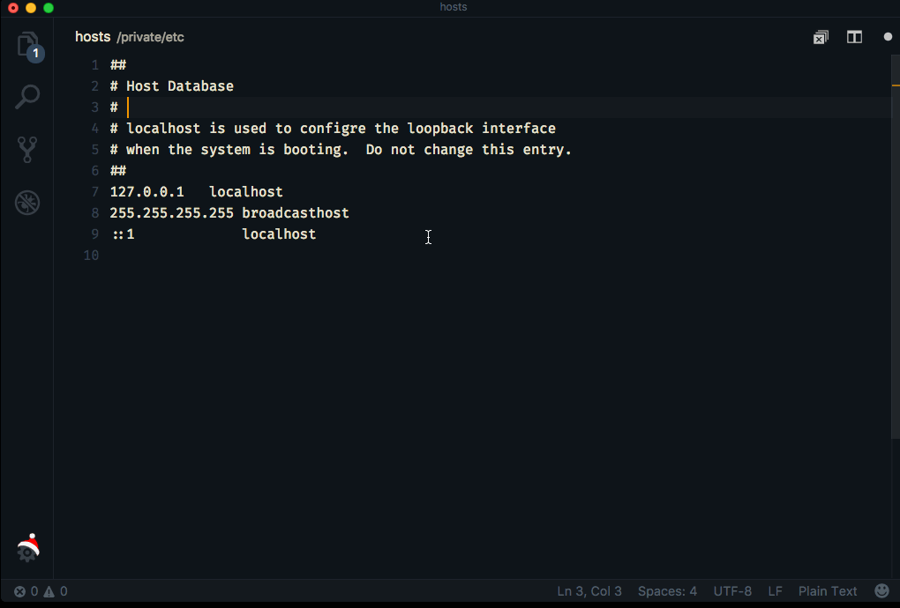
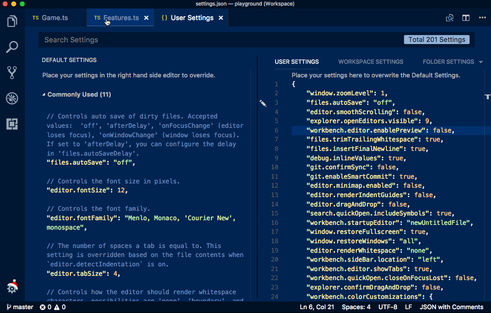

# January 2018 (version 1.20)

## Insiders Release

Welcome to the Insiders build. These are the preliminary notes for the January 1.20 release of Visual Studio Code. As we get closer to the release date, you'll see details below about new features and important fixes.

Until the January release notes are available, you can still track our progress:

* **[January Iteration Plan](https://github.com/Microsoft/vscode/issues/41061)** - See what's planned for the milestone.
* **[Commit Log](https://github.com/Microsoft/vscode/commits/master)** - GitHub commits to the vscode open source repository.
* **[Closed issues](https://github.com/Microsoft/vscode/milestone/58?closed=1)** - Resolved bugs and implemented feature requests in the December/January milestone.

We really appreciate people taking a look at our new features as soon as they are ready so check back here often and learn what's new to try out.

If you find issues or have suggestions, you can enter them in the VS Code repository on [GitHub](https://github.com/Microsoft/vscode/issues).

## Workbench

### Save files that need admin privileges

It is now possible to save files that require administrator privileges. One example is making changes to `/etc/hosts`. If the file exists on disk and requires elevated permissions, a new action **Retry as Admin...** will show up on an error message:

Saving as admin is supported on all platforms. Depending on the platform, the prompt to authenticate as administrator will look differently.

### Resizble Open Editors

Thanks to @ironyman open editors view can now be resized once it reaches the maximum size specified by `explorer.openEditors.visible`. Due to this the setting `explorer.openEditors.dynamicHeight` is no longer supported.

### More themable colors for editor tabs

With this release, new themable colors are added for editor tabs:

* `tab.hoverBackground`: Tab background color when hovering
* `tab.unfocusedHoverBackground`: Tab background color in an unfocused group when hovering
* `tab.hoverBorder`: Border to highlight tabs when hovering
* `tab.unfocusedHoverBorder`: Border to highlight tabs in an unfocused group when hovering

You can configure these colors also from the `workbench.colorCustomizations` setting.

### Custom drop-down (Windows, Linux)

On Windows and Linux, drop-downs now use a custom widget instead of the HTML control. The drop-down leverages the same colors as the tree/list widget in other parts:

This fixes a couple of issues where the HTML drop-down was not showing up properly in some cases.

### Disable macOS Touch Bar entries

A new setting `keyboard.touchbar.enabled` disables the macOS Touch Bar entries that VS Code is providing.

## New commands

Key|Command|Command id
---|-------|----------
`kb(workbench.action.moveEditorToFirstGroup)`|Move Editor into First Group|`workbench.action.moveEditorToFirstGroup`
`kb(workbench.action.moveEditorToSecondGroup)`|Move Editor into Second Group|`workbench.action.moveEditorToSecondGroup`
`kb(workbench.action.moveEditorToThirdGroup)`|Move Editor into Third Group|`workbench.action.moveEditorToThirdGroup`

Command `workbench.action.files.revealActiveFileInWindows` is a duplication of an already available command `revealFileInOS`. Therefore we are deprecating the `workbench.action.files.revealActiveFileInWindows` command in the January release and plan to drop it in February.

Command `workbench.action.files.copyPathOfActiveFile` is a duplication of an already available command `copyFilePath`. Therefore we are deprecating the `workbench.action.files.copyPathOfActiveFile` command in the January release and plan to drop it in February.

## Notable Changes

* [19707](https://github.com/Microsoft/vscode/issues/19707): Add "(Administrator)" suffix to window title when running as administrator in Windows
* [39536](https://github.com/Microsoft/vscode/issues/39536): Change to use async API for modal dialogs
* [7893](https://github.com/Microsoft/vscode/issues/7893): tweet feedback button - make it hideable

## Thank You

Last but certainly not least, a big *__Thank You!__* to the following folks that helped to make VS Code even better:

Contributions to `language-server-protocol`:

* [Waleed Khan (@arxanas)](https://github.com/arxanas): Fix typo: 'lastet' -> 'latest' [PR #359](https://github.com/Microsoft/language-server-protocol/pull/359)
* [Sven Efftinge (@svenefftinge)](https://github.com/svenefftinge): Fixed a link [PR #361](https://github.com/Microsoft/language-server-protocol/pull/361)
* [Jens Hausdorf (@jens1o)](https://github.com/jens1o): fix Cancelparameters not being displayed right [PR #367](https://github.com/Microsoft/language-server-protocol/pull/367)

Contributions to `vscode-languageserver-node`:

* [Remy Suen (@rcjsuen)](https://github.com/rcjsuen):
  * Correct some grammar and typos [PR #292](https://github.com/Microsoft/vscode-languageserver-node/pull/292)
  * Fix a parameter typo [PR #294](https://github.com/Microsoft/vscode-languageserver-node/pull/294)

<!-- In-product release notes styles.  Do not modify without also modifying regex in gulpfile.common.js -->
<a id="scroll-to-top" role="button" aria-label="scroll to top" href="#"></a>
<link rel="stylesheet" type="text/css" href="css/inproduct_releasenotes.css"/>
