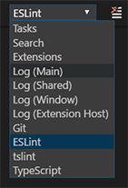
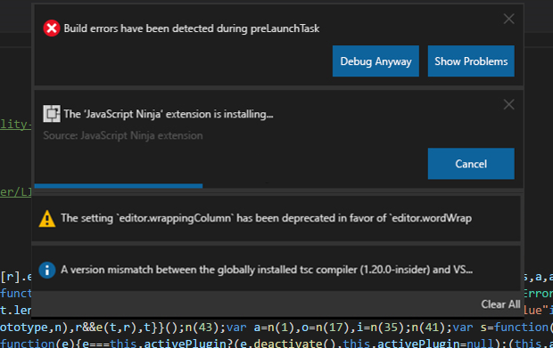
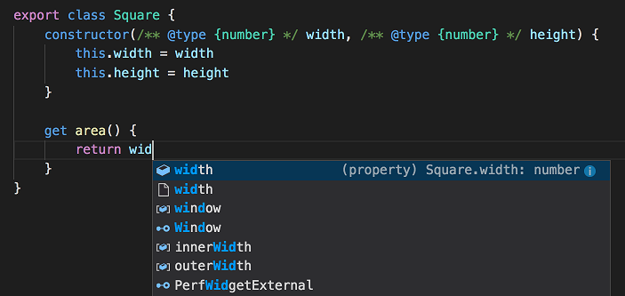
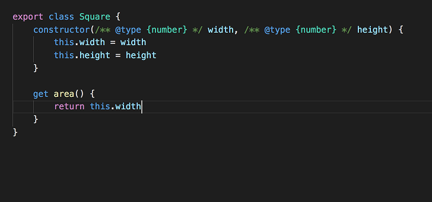
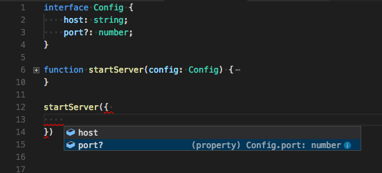
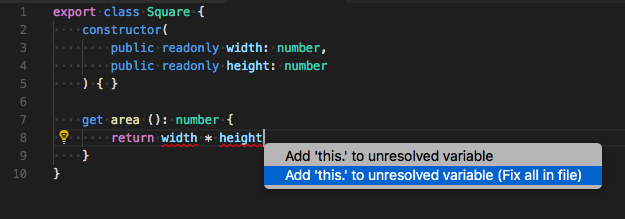
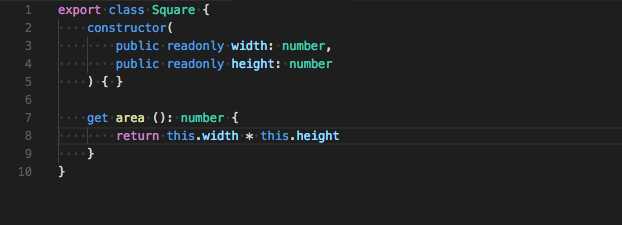
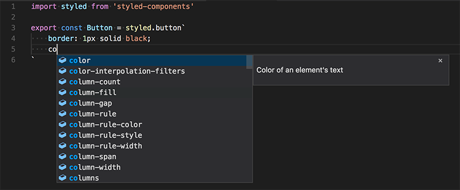

# January 2018 (version 1.20)

## Insiders Release

Welcome to the Insiders build. These are the preliminary notes for the January 1.20 release of Visual Studio Code. As we get closer to the release date, you'll see details below about new features and important fixes.

Until the January release notes are available, you can still track our progress:

* **[January Iteration Plan](https://github.com/Microsoft/vscode/issues/41061)** - See what's planned for the milestone.
* **[Commit Log](https://github.com/Microsoft/vscode/commits/master)** - GitHub commits to the vscode open source repository.
* **[Closed issues](https://github.com/Microsoft/vscode/milestone/58?closed=1)** - Resolved bugs and implemented feature requests in the December/January milestone.

We really appreciate people taking a look at our new features as soon as they are ready so check back here often and learn what's new to try out.

If you find issues or have suggestions, you can enter them in the VS Code repository on [GitHub](https://github.com/Microsoft/vscode/issues).

## Workbench

### Multi-Select in the Explorer and OPEN EDITORS view

You can now select multiple files in the Explorer and **OPEN EDITORS** view to run actions on multiple items.


As a consequence, clicking with the `Ctrl/Cmd` key pressed will no longer open an editor to the side because this key is now used to add more items to the multi-selection. A new setting `workbench.list.multiSelectModifier` allow you to change back to the old behavior by setting it to `"workbench.list.multiSelectModifier": "alt"`. With this setting, you use the `Alt` key to add items to the selection.

### Double-click to open in List/Tree

A new setting, `workbench.list.openMode`, was added that controls if items in trees and lists should open on single or double mouse-click. This setting applies both to opening items as well as expanding/collapsing items if they have children.

**Note:** The setting is supported for most trees/lists in VS Code, but in some case we left the default behavior when we thought single-click still makes the most sense. We are happy to hear your feedback!

### Save files that need admin privileges

It is now possible to save files that require administrator privileges. One example is making changes to `/etc/hosts`. If the file exists on disk and requires elevated permissions, a new action **Retry as Admin...** will show up on an error message:


Saving as admin is supported on all platforms. Depending on the platform, the prompt to authenticate as administrator will look differently.

### OPEN EDITORS updates

* Thanks to [@ironyman](https://github.com/ironyman), the **OPEN EDITORS** view can now be resized once it reaches the maximum size specified by `explorer.openEditors.visible`. Due to this change, the setting `explorer.openEditors.dynamicHeight` is no longer supported.
* The ability to set `explorer.openEditors.visible` to 0 to hide the **OPEN EDITORS** view is being deprecated in the January release and we plan to drop it in February. To hide the **OPEN EDITORS** view, use the context menu in the Explorer title area to control the visibility of views.

### More themable colors for editor tabs

With this release, new themable colors are added for editor tabs:

* `tab.hoverBackground`: Tab background color when hovering
* `tab.unfocusedHoverBackground`: Tab background color in an unfocused group when hovering
* `tab.hoverBorder`: Border to highlight tabs when hovering
* `tab.unfocusedHoverBorder`: Border to highlight tabs in an unfocused group when hovering


You can configure these colors also from the `workbench.colorCustomizations` setting.

### Custom drop-down (Windows, Linux)

On Windows and Linux, drop-downs now use a custom widget instead of the HTML control. The drop-down leverages the same colors as the tree/list widget in other parts:



This fixes a couple of issues where the HTML drop-down was not showing up properly in some cases.

### Disable macOS Touch Bar entries

A new setting `keyboard.touchbar.enabled` disables the macOS Touch Bar entries that VS Code is providing.

### New workbench.fontAliasing setting

You can now set `"workbench.fontAliasing": "auto"` to control font aliasing depending on the DPI of the monitor that VS Code is showing on. If set to `auto`, VS Code will apply `default` or `antialiased` automatically based on the DPI of the display.

### UX designs for notifications

During this milestone the UX team worked on redesigning the notifications experience in VS Code. Some of the shortcomings of our current design are:
* notifications are always on top of the editors, we want to explore to allow for moving/resizing them
* once a notification is dismissed, there is no way to get back to it
* it is not easily possible to read a notification if its text exceeds the size of the notification
* multiple notifications with buttons are hard to handle and look out of place



We plan to start development work on these designs in the February milestone. More details about the design can be found in this [GitHub issue](https://github.com/Microsoft/vscode/issues/22388#issuecomment-361915332) and we are happy for your feedback.

## Editor

### Save Large Files >256 MB

It is now possible to save files >256 MB where previously an error was reported. This was achieved by changing the implementation of how VS Code stores the contents of the editor to disk. Instead of loading the entire file contents into memory, we leverage a snapshot of the content and stream it into the file in chunks of 64KB.

### Keybindings for Quick Fixes and Code Actions

The new `editor.action.codeAction` command lets you configure keybindings for specific Code Actions. This keybinding for example triggers the Extract function refactoring Code Actions:

```json
{
  "key": "ctrl+shift+r ctrl+e",
  "command": "editor.action.codeAction",
  "args": {
    "kind": "refactor.extract.function"
  }
}
```

Code Action kinds are specified by extensions using the enhanced `CodeActionProvided` API. Kinds are hierarchical, so `"kind": "refactor"` will show all refactoring Code Actions, whereas `"kind": "refactor.extract.function"` will only show Extract function refactorings.

Using the above keybinding, if only a single `"refactor.extract.function"` Code Action is available, it will be automatically applied. If multiple Extract function Code Actions are available, we bring up a context menu to select them:


You can also control how/when Code Actions are automatically applied using the `apply` argument:

```json
{
  "key": "ctrl+shift+r ctrl+e",
  "command": "editor.action.codeAction",
  "args": {
    "kind": "refactor.extract.function",
    "apply": "first"
  }
}
```

Valid values for `"apply"`:

* `"first"` - Always automatically apply the first available Code Action.
* `"ifSingle"` - Default. Automatically apply the Code Action if only one is available. Otherwise, show the context menu.
* `"never"` — Always show the Code Action context menu, even if only a single Code Action is available.

## Global Snippets

There is now the option for global snippets - that is snippets that aren't scoped to a single language but snippets that can target many or all kinds of files. Hit 'F1 > Configure User Snippets' and select 'New Global Snippets file'. That will open a `.code-snippets`-file which allow you to define new snippets, use the `scope`-attribute to list the languages that are targeted by a snippet. For instance, the snippet below shows the copyright-header we add to JS and TS files:

```json
"JS & TS Stub": {
  "scope": "javascript,typescript",
  "prefix": "stub",
  "body": [
    "/*---------------------------------------------------------------------------------------------",
    " *  Copyright (c) Microsoft Corporation. All rights reserved.",
    " *  Licensed under the MIT License. See License.txt in the project root for license information.",
    " *--------------------------------------------------------------------------------------------*/",
    "",
    "'use strict';",
    "",
    "$0"
  ],
  "description": "Insert Copyright Statement"
}
```

We didn't forget extensions-authors and when crafting snippet extensions you can also contribute global snippets. Simply use a `code-snippets`-file and omit the language property when contributing.

## More Snippet Variables

We have added new snippet variables to read your clipboard and to insert the current date and time. Use `CLIPBOARD` and for date and time combine any of these variables: `CURRENT_YEAR`, `CURRENT_YEAR_SHORT`, `CURRENT_MONTH`, `CURRENT_DATE`, `CURRENT_HOUR`, `CURRENT_MINUTE`, `CURRENT_SECOND`.

## Suggest Memory 2

We have refined how suggestions are memorized and we have added a new setting for this: `editor.suggestSelection` controls how suggestions are selected in the UI. You can make sure the top item is always selected (`first`), you can make it select an item you have inserted in the past (`recentlyUsed`), or you can selected items based on prefixes you have completed in the last (`recentlyUsedByPrefix`). A more complete explaintation and images(!) can be found here: https://github.com/Microsoft/vscode/issues/41060#issuecomment-360529596

## Languages

### TypeScript 2.7.1

VS Code now ships with TypeScript 2.7.1. This update brings a number of new features and bug fixes.

### Bracket property suggestions

Spaces got you down? When you type `.`, VS Code now shows all known properties for JavaScript and TypeScript, even if a property name contain whitespaces or other non-identifier characters.


Accepting one of these suggestions automatically converts to bracket accessor notation.


### Automatic member property suggestions

Tired of typing `this.` to access class properties in JavaScript and TypeScript? Now you can just start typing to see available members.



Accept a member property suggestion, and VS Code automatically inserts the require `this.`.



### Recommended suggestions

### Marking of optional property in suggestions

Suggestions for optional TypeScript properties are now suffixed with a `?`:



JavaScript users will also see `?` for completions that come from `*.d.ts` Type Declaration (typings) packages.

### Quick Fix all for JavaScript and TypeScript

Fix errors in a flash with new Quick Fix all for JavaScript and TypeScript. Move your cursor to a fixable error such as an unused variable, and trigger Quick Fixes using the lightbulb or by pressing `kb(editor.action.quickFix)`. If one of the available Quick Fixes can be applied to multiple errors in the current file, you'll see a new **Fix all in file** Code Action.



Accept and all errors will disappear:



### Extension contributed TypeScript plugins

[TypeScript plugins](https://github.com/Microsoft/TypeScript/wiki/Writing-a-Language-Service-Plugin) let developers extend VS Code's JavaScript and TypeScript language support. For example, a TypeScript plugin might add additional linting to a file or add IntelliSense when working within JavaScript template strings.



TypeScript plugins were first introduced in TypeScript 2.3, but they previously required installing plugins into your workspace with `npm` and then configuring a `jsconfig.json` or `tsconfig.json` file to load them. VS Code 1.20 simplifies this by allowing extensions to contribute a set of global TypeScript plugins that are automatically activated without any configuration. All you need to do is install the extension.

A few extensions are already making use of this:

* [vscode-styled-components](https://marketplace.visualstudio.com/items?itemName=jpoissonnier.vscode-styled-components) — Syntax highlighting, IntelliSense, and error reporting for [styled-component](https://github.com/styled-components/styled-components) CSS strings.
* [lit-html](https://marketplace.visualstudio.com/items?itemName=bierner.lit-html) — Syntax highlighting, IntelliSense, and formatting for [lit-html](https://github.com/Polymer/lit-html) template strings.

Extension contributed plugins are automatically activated for VS Code's version of TypeScript. If you are using a workspace version of TypeScript, you must still install the TypeScript plugins in your workspace.

Our extension authoring documentation has more information about the new [TypeScript Plugin contribution point](https://code.visualstudio.com/docs/extensionAPI/extension-points#_contributestypescriptserverplugins). We're very excited to see how extension authors leverage this!

## Extension Authoring

### Add, remove and change workspace folders

A new proposed API was added to change workspace folders in the currently opened workspace:

```typescript
updateWorkspaceFolders(
  start: number,
  deleteCount: number,
  ...workspaceFoldersToAdd: { uri: Uri, name?: string }[]
): boolean
```

This method can:

* Remove existing workspace folders (by providing the index of the folder to delete via `start` and the number of folders to remove via `deleteCount`).
* Add new workspace folders to a specific index (by providing the index where to add to via `start`, leaving `deleteCount` as `0` and providing the workspace folders to add as arguments).
* Update existing folders, for example, move them or rename them (by removing existing folders first and then adding them back again).

We plan to add this API to stable in a future milestone once we are confident enough with it. We welcome any feedback on how it works for your extension.

### New menu group identifiers

Several menus now have new group identifiers for finer control on command placement:

**Editor Tab context menu**

* `1_close`: Commands related to closing editors
* `3_preview`: Commands related to pinning editors

**Editor Title menu**

* `1_diff`: Commands related to working with diff editors
* `3_open`: Commands related to opening editors
* `5_close`: Commands related to closing editors

### CodeActionProvider improvements

A `CodeActionProvider` can now return objects of the new `CodeAction` class. `CodeAction` adds additional metadata and functionality over `Command`, and better captures what Code Actions are and how they are used in VS Code's UI.

A `CodeAction` primarily consists of a `title`, `kind`, and at least a `Command` or (new in VS Code 1.20) a `WorkspaceEdit`.

```ts
import * as vscode from 'vscode'

/**
 * Quick fix provider that converts :) to 😀
 */
export class Emojizer implements vscode.CodeActionProvider {
    provideCodeActions(document: vscode.TextDocument, range: vscode.Range) {
        const pos = range.start;
        const line = document.lineAt(pos.line);

        // Check if we are at a :)
        if (line.text[pos.character] === ':' && line.text[pos.character + 1] === ')') {
            const fix = new vscode.CodeAction('Convert to 😀', vscode.CodeActionKind.QuickFix);
            fix.edit = new vscode.WorkspaceEdit();
            fix.edit.replace(document.uri, new vscode.Range(pos, pos.translate(0, 2)), '😀');
            return [fix];
        }
        return undefined;
    }
}
```

`CodeAction` also adds metadata about Code Actions, including the Code Action's kind (`vscode.CodeActionKind.QuickFix` in the example above) and the set of diagnostics that the Code Action addresses. We use this metadata to implement features such as the `Refactor` command and `vscode.action.codeAction` keybindings, and plan to build additional features using it in the future.

### Remove files from the Open Recent list

A new command `vscode.removeFromRecentlyOpened` removes entries from the **Open Recent** list in the **File** menu.

## New commands

Key|Command|Command id
---|-------|----------
`kb(editor.action.refactor)`|Open refactoring context menu at current position|`workbench.action.refactor`
`kb(workbench.action.moveEditorToFirstGroup)`|Move Editor into First Group|`workbench.action.moveEditorToFirstGroup`
`kb(workbench.action.moveEditorToSecondGroup)`|Move Editor into Second Group|`workbench.action.moveEditorToSecondGroup`
`kb(workbench.action.moveEditorToThirdGroup)`|Move Editor into Third Group|`workbench.action.moveEditorToThirdGroup`
`kb(list.expandSelectionDown)`|Multi-Select in lists/trees: expand selection down|`list.expandSelectionDown`
`kb(list.expandSelectionUp)`|Multi-Select in lists/trees: expand selection up|`list.expandSelectionUp`

Command `workbench.action.files.revealActiveFileInWindows` is a duplication of an already available command `revealFileInOS`. Therefore we are deprecating the `workbench.action.files.revealActiveFileInWindows` command in the January release and plan to drop it in February.

Command `workbench.action.files.copyPathOfActiveFile` is a duplication of an already available command `copyFilePath`. Therefore we are deprecating the `workbench.action.files.copyPathOfActiveFile` command in the January release and plan to drop it in February.

## Notable Changes

* [19707](https://github.com/Microsoft/vscode/issues/19707): Add "(Administrator)" suffix to window title when running as administrator in Windows
* [39536](https://github.com/Microsoft/vscode/issues/39536): Change to use async API for modal dialogs
* [7893](https://github.com/Microsoft/vscode/issues/7893): Tweet feedback button - make it hideable

## Thank You

Last but certainly not least, a big *__Thank You!__* to the following folks that helped to make VS Code even better:

* [BlueC0re(@bluec0re)](https://github.com/bluec0re): Pointed out a security vulnerability that we have addressed in version 1.19.3.

Contributions to `vscode-extension-samples`:

* [Nathan Boyd (@nathan-boyd)](https://github.com/nathan-boyd): Add build output directories to list of possible file exclusions [PR #46](https://github.com/Microsoft/vscode-extension-samples/pull/46)

Contributions to `language-server-protocol`:

* [Waleed Khan (@arxanas)](https://github.com/arxanas): Fix typo: 'lastet' -> 'latest' [PR #359](https://github.com/Microsoft/language-server-protocol/pull/359)
* [Sven Efftinge (@svenefftinge)](https://github.com/svenefftinge): Fixed a link [PR #361](https://github.com/Microsoft/language-server-protocol/pull/361)
* [Jens Hausdorf (@jens1o)](https://github.com/jens1o): fix Cancelparameters not being displayed right [PR #367](https://github.com/Microsoft/language-server-protocol/pull/367)

Contributions to `vscode-languageserver-node`:

* [Remy Suen (@rcjsuen)](https://github.com/rcjsuen):
  * Correct some grammar and typos [PR #292](https://github.com/Microsoft/vscode-languageserver-node/pull/292)
  * Fix a parameter typo [PR #294](https://github.com/Microsoft/vscode-languageserver-node/pull/294)
  * Fix a few small typos [PR #302](https://github.com/Microsoft/vscode-languageserver-node/pull/302)

Contributions to `vscode-eslint`:

* [Josh Unger(@joshunger)](https://github.com/joshunger): update error message and add a hint to update yarn setting if using yarn [PR #390](https://github.com/Microsoft/vscode-eslint/pull/390)

<!-- In-product release notes styles.  Do not modify without also modifying regex in gulpfile.common.js -->
<a id="scroll-to-top" role="button" aria-label="scroll to top" href="#"><span class="icon"></span></a>
<link rel="stylesheet" type="text/css" href="css/inproduct_releasenotes.css"/>
