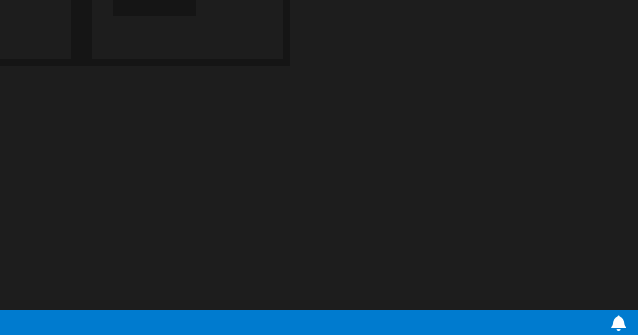

# March 2018 (version 1.22)

## Insiders Release

Welcome to the Insiders build. These are the preliminary notes for the March 1.22 release of Visual Studio Code. As we get closer to the release date, you'll see details below about new features and important fixes.

Until the March release notes are available, you can still track our progress:

* **[Commit Log](https://github.com/Microsoft/vscode/commits/master)** - GitHub commits to the vscode open source repository.
* **[Closed issues](https://github.com/Microsoft/vscode/milestone/64?closed=1)** - Resolved bugs and implemented feature requests in the March milestone.

We really appreciate people taking a look at our new features as soon as they are ready so check back here often and learn what's new to try out.

If you find issues or have suggestions, you can enter them in the VS Code repository on [GitHub](https://github.com/Microsoft/vscode/issues).

## Workbench

### Windows: workaround for scroll lag on certain devices

We have received numerous reports that scrolling on Windows on certain devices is very laggy and not smooth (see [issue 13612](https://github.com/Microsoft/vscode/issues/13612) for details). As a workaround to make scrolling smooth again, a new setting `window.smoothScrollingWorkaround` can be set to `true`. Since this is just a workaround which can result in a little bit of flicker whenever you restore the window from the task bar, this setting is not enabled by default. It has no other side effects other than that so you can enable it without having to worry.

### Electron 2.0 Exploration

During this milestone we have explored to bundle VS Code with Electron 2.0.0. This is a major new Electron release that comes with Chrome 61 and node.js 8.x (a major leap forward compared to our current version that has Chrome 58 and node.js 7.x). We think that we can push out the update to our insider users early next month to gather additional feedback. If you are intersted in helping out, make sure to install VS Code Insiders from https://code.visualstudio.com/insiders.

### New setting to open empty window when starting Code without arguments

A new setting `window.openWithoutArgumentsInNewWindow` was introduced to control if running Code without arguments should focus the last active instance or open a new empty window. On Windows and Linux this setting is enabled by default to better match platform behaviour. This means that e.g. double clicking the Code icon from the desktop or running Code without arguments from the command line will open a new empty window instead of putting focus to the last active instance. The same is true on Windows when middle-clicking or shift-clicking on the taskbar icon.

Just set this setting to `off` to disable this behaviour.

## Debugging

### postDebugTask in launch.json

We have added `"postDebugTask"` support in `launch.json`. This task will get run after a debug session finishes. Similiar to `preLaunchTask` you can reference the task in you `tasks.json` by a name. Here's an example of a launch configuration using this:

```json
{
    "name": "Attach to node server",
    "type": "node",
    "request": "attach",
    "port": 8008,
    "preLaunchTask": "Start Server",
    "postDebugTask": "Stop Server"
}
```

### Debug icons consistency polish

We have polished all our debug icons such that they are now more consistent in size and use of color across the workbench.

## Extension Authoring

### Show long running operations as notification with cancellation support

We added new API to show long running operations in the notification area with optional cancellation support. The benefits of showing long running operations here are:
* multiple operations can report progress at the same time
* you can show discrete progress
* you can optionally allow the user to cancel the operation



All you have to do is to call `window.withProgress` with the new progress location `ProgressLocation.Notification`. You can set `cancellable` to `true` to show a cancel button and check for cancellation on the provided `CancellationToken` in the callback. To report discrete progress, leverage the `percentage` value when reporting progress.

Full example code:

```typescript
vscode.window.withProgress({
    location: vscode.ProgressLocation.Notification,
    title: "I am long running!",
    cancellable: true
}, (progress, token) => {
    token.onCancellationRequested(() => {
        console.log("User canceled the long running operation")
    });

    setTimeout(() => {
        progress.report({ percentage: 10, message: "I am long running! - still going..."});
    }, 1000);

    setTimeout(() => {
        progress.report({ percentage: 50, message: "I am long running! - still going even more..."});
    }, 2000);

    setTimeout(() => {
        progress.report({ percentage: 90, message: "I am long running! - almost there..."});
    }, 3000);

    var p = new Promise(resolve => {
        setTimeout(() => {
            resolve();
        }, 5000);
    });

    return p;
});
```

### Disposing a CancellationToken no longer sets the token to cancelled state

Calling `dispose()` on a `CancellationToken` previously would set the token to be cancelled and trigger the cancellation event. We changed this to no longer do so in order to be able to dispose tokens without cancelling them. If you rely on the cancellation of the token, call the `cancel()` method.

## Notable Changes

* [35675](https://github.com/Microsoft/vscode/issues/35675): Font rendering looks ugly on Linux
* [13905](https://github.com/Microsoft/vscode/issues/13905): Windows: Middle mouse click on taskbar icon doesn't open a new window

## Thank You

Last but certainly not least, a big *__Thank You!__* to the following folks that helped to make VS Code even better:

Contributions to `vscode`:

Contributions to `vscode-extension-vscode`:

* [Danny Tuppeny @(DanTup)](https://github.com/DanTup):
  * Check for presence of code executable instead of just folder (#95) [PR #95](https://github.com/Microsoft/vscode-extension-vscode/pull/95)
  * Place VS Code inside insiders/stable sub-folders of .vs-test (#97) [PR #97](https://github.com/Microsoft/vscode-extension-vscode/pull/97)
  * Don't download Code every time on Windows (#102) [PR #102](https://github.com/Microsoft/vscode-extension-vscode/pull/102)
  * Add support for Mocha's forbidOnly (#103) [PR #103](https://github.com/Microsoft/vscode-extension-vscode/pull/103)

Contributions to `vscode-nls`:

* [Ruben Bridgewater (@BridgeAR)](https://github.com/BridgeAR): Use sync fs.mkdir [PR #17](https://github.com/Microsoft/vscode-nls/pull/17)

Contributions to `language-server-protocol`:

* [Igor Matuszewski (@Xanewok)](https://github.com/Xanewok): Change message params types to match JSON-RPC spec [PR #373](https://github.com/Microsoft/language-server-protocol/pull/373)

<!-- In-product release notes styles.  Do not modify without also modifying regex in gulpfile.common.js -->
<a id="scroll-to-top" role="button" aria-label="scroll to top" href="#"><span class="icon"></span></a>
<link rel="stylesheet" type="text/css" href="css/inproduct_releasenotes.css"/>
