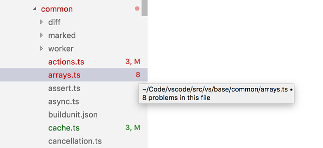
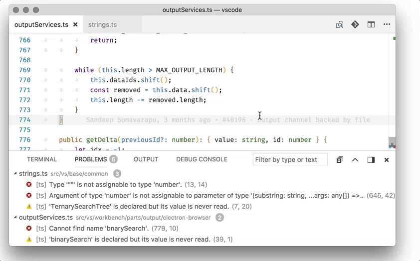
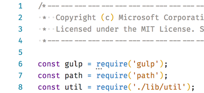
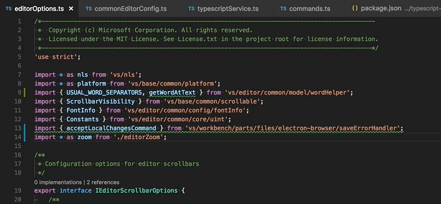
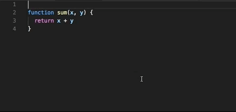
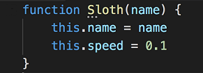
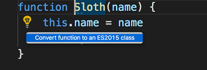

# March 2018 (version 1.22)

## Insiders Release

Welcome to the Insiders build. These are the preliminary notes for the March 1.22 release of Visual Studio Code. As we get closer to the release date, you'll see details below about new features and important fixes.

Until the March release notes are available, you can still track our progress:

* **[March Iteration Plan](https://github.com/Microsoft/vscode/issues/45632)** - See what's planned for the milestone.
* **[Commit Log](https://github.com/Microsoft/vscode/commits/master)** - GitHub commits to the vscode open source repository.
* **[Closed issues](https://github.com/Microsoft/vscode/milestone/64?closed=1)** - Resolved bugs and implemented feature requests in the March milestone.

We really appreciate people taking a look at our new features as soon as they are ready so check back here often and learn what's new to try out.

If you find issues or have suggestions, you can enter them in the VS Code repository on [GitHub](https://github.com/Microsoft/vscode/issues).

## Workbench

### Windows: workaround for scroll lag

We have received reports that scrolling on Windows on certain devices is very laggy and does not move smoothly (see [issue 13612](https://github.com/Microsoft/vscode/issues/13612) for details). As a workaround for smooth scrolling, a new setting `window.smoothScrollingWorkaround` can be set to `true`. Since this is a workaround and can result in flicker whenever you restore the window from the taskbar, this setting is not enabled by default. You should see no other side effects if you enable the setting.

### Open empty window when launching VS Code without arguments

A new setting `window.openWithoutArgumentsInNewWindow` was introduced to control whether launching VS Code without arguments should focus the last active instance or open a new empty window. On Windows and Linux, this setting is enabled by default to better match platform behavior. When enabled, double clicking the VS Code icon from the desktop or running VS Code without arguments from the command line will open a new empty window. The same is true on Windows when middle-clicking or shift-clicking on the taskbar icon. Disable this behavior by explicitly setting `window.openWithoutArgumentsInNewWindow` to `off`'.

### Electron 2.0 Exploration

During this milestone, we explored bundling Electron 2.0.0 into VS Code. This is a major Electron release and comes with Chrome 61 and Node.js 8.x (a major leap forward compared to our current version that has Chrome 58 and Node.js 7.x). We think that we can push out the update to our Insiders users early next month to gather additional feedback. If you are interested in helping out, make sure to install VS Code Insiders from https://code.visualstudio.com/insiders.

### Explorer shows Errors & Warnings

Not exactly new, but now final and enabled by default. Errors and warnings in a file are now shown as decoration in the explorer.



In the sample pictured above, two files have errors ('action.ts' and 'arrays.ts') and the file 'cache.ts' as three warnings.

## Editor

### Diagnostics and References Navigation

With this release navigating errors and warnings via F8 (F1 > Go to Next Problem) takes all reported errors into account. Instead of looping inside one file it will take you to the next file with errors and back.



Similar to this is a new command that allows to navigate to reference search results. Trigger 'Find References' on a symbol and now use F4 and Shift+F4 to visit each reference. This is great to make edits in all places that reference a symbol because your fingers don't need to leave the keyboard anymore.


### Hints in the Editor

The extension API allows to create hint-diagnostics. Those aren't errors or warnings but suggestions how something could be made better, e.g by running a certain refactoring.

We now render such diagnostics with an ellipsis under the start of the word in question.




### Configurable Format On Save Timeout

VS Code allows to run formatters just before saving a file to disk. For that, speed matters because a slow extension would slow down saving. Because we don't like slow saving VS Code is very strict and cancels a format-on-save-request after 750ms. For some extensions, esp. when dealing with large files, that's not enough and we have added a new setting `"editor.formatOnSaveTimeout"` which allows to configure the timeout. For you, to see what's going on, there is now a little progress indication in the statusbar.


## Even more Snippet variables

There are new snippet variables for referring to the current data and time. In addition to numbers, e.g. 28/3/2018 you can now use names like '28 of March'. The new variables are: `${CURRENT_DAY_NAME}`, `${CURRENT_DAY_NAME_SHORT}`, `${CURRENT_MONTH_NAME}`, and `${CURRENT_MONTH_NAME_SHORT}`.

## Debugging

### Log Points

We have added support for log points this milestone. Log points are breakpoints which do not stop the program execution but simply print out a log message. Log messages can have expressions within `{}` curly brackets which get evaluated. Log points are especially useful for debugging production servers which cannot be stopped.

Log points are currently supported by the node debug extension, but other extensions are soon to follow. Just like regular breakpoints, log points can be enabled or disabled and can also have conditions. Log points are decorated with a diamond shaped icon.

TODO@isidor add picture

### postDebugTask in launch.json

We have added `postDebugTask` support in `launch.json`. This task is run after a debug session finishes. Similar to `preLaunchTask`, you can reference tasks in your `tasks.json` by a name. Here's an example of a launch configuration using a `postDebugTask`:

```json
{
    "name": "Attach to node server",
    "type": "node",
    "request": "attach",
    "port": 8008,
    "preLaunchTask": "Start Server",
    "postDebugTask": "Stop Server"
}
```

### Debug icons consistency polish

We  polished all our debug icons so that they are more consistent in size and use of color across the workbench.

## Languages

### Fold Markdown documents by heading level

You can now fold Markdown documents by heading:


Folding a header collapses all content and subheadings under that header.

### TypeScript 2.8

VS Code now ships with TypeScript 2.8. This update brings support for some cool [new language features](https://github.com/Microsoft/TypeScript/wiki/What%27s-new-in-TypeScript#typescript-28), as well as many important bug fixes and tooling improvements.

### Organize imports for JavaScript and TypeScript

The new organize imports command (`kb(typescript.organizeImports)`) removes unused imports and sorts the remaining imports:



The command works in ES6 modules for both JavaScript and TypeScript.

### Improved quick suggestions in JSDocs

Did you know that VS Code provides IntelliSense for JSDoc types? This feature was added a number of releases ago but you may not have realized it because the IntelliSense only showed up if you manually invoked it. In VS Code 1.22, quick suggestions are now enabled by default in JSDoc types. Just start typing to IntelliSense kicks in:



### Suggestion code actions for JavaScript and TypeScript

We've also improved discoverability  of JavaScript and TypeScript suggestion code actions. These are proposed changes that can help you quickly improve or clean up your code. They are shown using the lightbulb widget but unlike quick fixes, they do not address a specific error or warning in your code. Example suggestion code actions include: convert ES5 class to ES6 class and covert commonjs module to ES6 module.

Suggestion code action are now indicated by a `...` in the editor:



Move the cursor over the `...` and click on the lightbulb or press `kb(editor.action.quickFix)` to display available code actions:





We plan to continue adding additional suggestions. Let us know if you have any that you would like to see.

Suggestion code actions are enabled by default in JavaScript and TypeScript. You can disable them by setting: `"typescript.suggestionActions.enabled": false` or `"javascript.suggestionActions.enabled": false`

## Extension Authoring

### Show long running operations as notifications with cancellation support

We added a new API to show long running operations in the Notification Center with optional cancellation support. The benefits of showing long running operations here are:

* Multiple operations can report progress at the same time.
* You can show operation progress.
* The user has the option to cancel the operation.


Call `window.withProgress` with the new progress location `ProgressLocation.Notification`. Set `cancellable` to `true` to show a cancel button and check for cancellation on the provided `CancellationToken` in the callback. To display progress, leverage the `increment` value when reporting progress. See https://github.com/Microsoft/vscode-extension-samples/tree/master/progress-sample for an extension sample on this new API.

### Disposing a CancellationToken no longer sets the token to cancelled state

Calling `dispose()` on a `CancellationToken` previously would set the token to be cancelled and trigger the cancellation event. We changed the behavior in order to be able to dispose of tokens without cancelling them. If you rely on the cancellation of the token, call the `cancel()` method.

### Simple editors are not passed to extensions

Inputs that use the editor like the debug REPL input are no longer passed to extensions as editors. This means that both the `onDidChangeActiveTextEditor` will not trigger when user focuses the debug REPL, and that the `onDidChangeTextDocument` will also not fire. The reason behind this change is that the REPL input uses the editor as an implementation detail and extension should not be notified of this since it is not a "real editor".

## Notable Changes

* [35675](https://github.com/Microsoft/vscode/issues/35675): Font rendering looks ugly on Linux
* [13905](https://github.com/Microsoft/vscode/issues/13905): Windows: Middle mouse click on taskbar icon doesn't open a new window
* [44411](https://github.com/Microsoft/vscode/issues/44411): Bail out from launch for unresolvable variables
* [44554](https://github.com/Microsoft/vscode/issues/44554): Allow to DND multiple root-folders
* [45647](https://github.com/Microsoft/vscode/issues/45647): Pass "Visual Studio Code" as a new attribute "clientName" in the "initialize" request
* [45972](https://github.com/Microsoft/vscode/issues/45972): Explorer: Reduce call count of isEqualOrParent

## Thank You

Last but certainly not least, a big *__Thank You!__* to the following folks that helped to make VS Code even better:

Contributions to `vscode`:

Contributions to `vscode-extension-vscode`:

* [Danny Tuppeny @(DanTup)](https://github.com/DanTup):
  * Check for presence of code executable instead of just folder (#95) [PR #95](https://github.com/Microsoft/vscode-extension-vscode/pull/95)
  * Place VS Code inside insiders/stable sub-folders of .vs-test (#97) [PR #97](https://github.com/Microsoft/vscode-extension-vscode/pull/97)
  * Don't download Code every time on Windows (#102) [PR #102](https://github.com/Microsoft/vscode-extension-vscode/pull/102)
  * Add support for Mocha's forbidOnly (#103) [PR #103](https://github.com/Microsoft/vscode-extension-vscode/pull/103)

Contributions to `vscode-nls`:

* [Ruben Bridgewater (@BridgeAR)](https://github.com/BridgeAR): Use sync fs.mkdir [PR #17](https://github.com/Microsoft/vscode-nls/pull/17)

Contributions to `language-server-protocol`:

* [Igor Matuszewski (@Xanewok)](https://github.com/Xanewok): Change message params types to match JSON-RPC spec [PR #373](https://github.com/Microsoft/language-server-protocol/pull/373)

Contributions to `vscode-languageserver-node`:

* [Matt Acosta (@mattacosta)](https://github.com/mattacosta): Typo fixes [PR #327](https://github.com/Microsoft/vscode-languageserver-node/pull/327)

<!-- In-product release notes styles.  Do not modify without also modifying regex in gulpfile.common.js -->
<a id="scroll-to-top" role="button" aria-label="scroll to top" href="#"><span class="icon"></span></a>
<link rel="stylesheet" type="text/css" href="css/inproduct_releasenotes.css"/>
