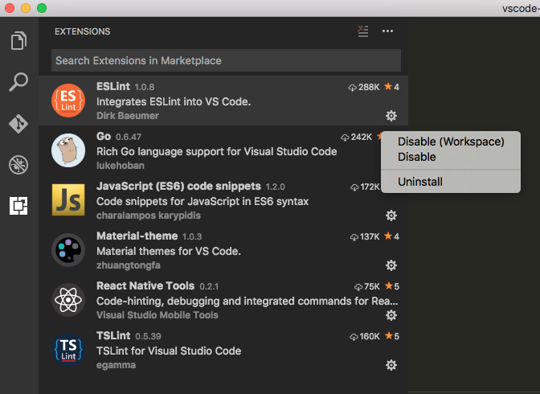
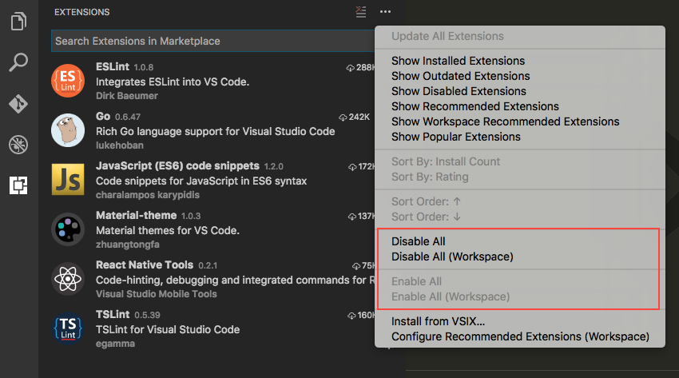
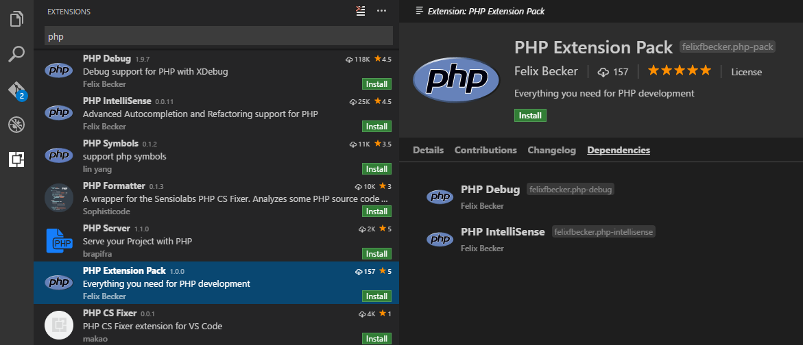

# October 2016 (version 1.7)

Welcome to the October release of Visual Studio Code. There are a number of significant updates in this version that we hope you will like, some of the key highlights include:

* **[Horizontal layout](#horizontal-layout)** - Organize your editors in either vertical or horizontal groups.
* **[Disable extensions](#disable-extensions)** - Quickly disable an Extension globally or for a specific workspace.
* **[Keyboard shortcuts PDF](#keyboard-shortcuts-reference)** - New printable keyboard shortcuts cheat sheet.
* **[Keymaps for Sublime and Atom](#keymaps-category)** - You can now use these well-known keyboard shortcuts within VS Code.
* **[Extension Packs](#extension-packs)** - View dependencies of an Extension pack right in the Extension details.
* **[JavaScript IntelliSense](#better-javascript-intellisense)** - VS Code automatically installs JavaScript module and library type information.
* **[CSS autocompletion within HTML](#css-completions-in-html)** - Get rich auto completion for CSS embedded in your HTML.
* **[Simplified debugging](#simplified-launch-configuration)** - Quickly configure your debugging sessions.
* **[Debug hit count control](#hit-count-conditional-breakpoints)** - Set breakpoint hit count conditions.

The release notes are arranged in the following sections related to VS Code focus areas. Here are some further updates:

* **[Workbench](#workbench)** - Some View states now persisted in user settings. Open multiple files from Quick Open.
* **[Editor](#editor)** - Keyboard shortcuts reference, finer formatting control.
* **[Languages](#languages)** - JavaScript and CSS improvements.
* **[Extensions](#extensions)** - New categories for Keymaps and Formatters for easier search.
* **[Node.js Debugging](#node-debugging)** - Multi-target debugging support, new debugging settings.
* **[Extension Authoring](#extension-authoring)** - Support for extension CHANGELOG.md files. Add to the editor tab context menu.

## Workbench

### Horizontal layout

You can now change the layout of editor groups to be either vertical or horizontal. Both layouts behave the same as before allowing you to move and resize editors and editor groups.


To enable horizontal layout for the current workspace, use:

* The **View** menu **Toggle Editor Group Layout**.
* The Command Palette **Toggle Vertical/Horizontal Editor Group Layout**.
* An action in the header of the **OPEN EDITORS** view.

There is also a keyboard shortcut (`kb(workbench.action.toggleEditorGroupLayout)`) to quickly switch between the two layouts.

Once you made your choice for the layout, we persist it for the current workspace and restore it after restart.

### Some View preferences moved to user settings

We changed some of the toggles in the View menu to update your user settings file instead of persisting their state in the browser. This will make it easier to restore the same state on a different machine by copying the settings file.

The following settings will now be changed in your user settings file when you change them from the View menu:

* `workbench.sideBar.location` to control the position of the Sidebar (left or right)
* `workbench.statusBar.visible` to control the visibility of the Status Bar

In addition, changing the Zoom level from the View menu now writes to `window.zoomLevel`.

### Open multiple files from Quick Open

Thanks to [Will Prater (@wprater)](https://github.com/wprater), you can now open multiple files from Quick Open by just pressing the Right arrow key. This will open the currently selected file in the background and you can continue selecting files from Quick Open.

### Toggle Maximized Panel

We have introduced a global workbench command that maximizes the size of the panel (80% of the total height). If the panel is maximized this command will shrink the panel to it's previous size.

## Editor

### Keyboard shortcuts reference

**Help** > **Keyboard Shortcuts Reference** brings up a printable PDF reference sheet of VS Code command keyboard shortcuts. Keep this reference handy and you'll be a VS Code power user in no time.

### Format Document / Format Selection

## Languages

### Better JavaScript IntelliSense

VS Code uses the TypeScript language server to provide IntelliSense in JavaScript files. In the past, you had to create a `jsconfig.json` file. You also had to manually install typings (Type Definition) files for all the modules and libraries you were using. That's not an easy chore, particularly when you are a pure JavaScript developer.

We talked with our friends on the TypeScript team and they came up with "Automated Typings Acquisition". ATA eliminates the need for a `jsconfig.json` file and makes typings files almost invisible. A TypeScript language server that has ATA enabled watches your `package.json` files and installs for all dependencies the typings files automatically in a global cache on your file system. It does the same when it finds references to well known client-side libraries. When you then invoke IntelliSense, the TypeScript server uses the global cache of typings files.

We think this is so cool that we wanted you to get your hands on it as soon as possible. Our integration of ATA is still rough around the edges, but we decided to enable it by default. Should you experience issues, you can switch it off by setting `typescript.disableAutomaticTypeAcquisition` to `true` in your user settings.

Here are a few points you should be aware of when using ATA:

- ATA is backward compatible. If you have a `typings` folder or you installed typings using `npm`, then those take precedence over the automatically acquired typings files.
- ATA acquires the latest available version of the typings files. If you depend on an older version of a library or module then there can be discrepancies between the actual API exposed by the library or module and the API described in the typings file. If you require a specific version of a typings files, you can install it manually: `npm install @typings/<module name>@x.y.z`.
- An increasing number of npm modules bundle their typings files, meaning the only way to acquire the typings is by installing the module. ATA does not install npm modules for you.

### CSS completions in HTML

## Extensions

### Disable extensions

Often you have more than one workspace and various Extensions installed to support these workspaces. Most of the times, these extensions are exclusive to a single workspace and not needed for others. For example, if you have JavaScript and Go language workspaces, you do not need JavaScript linting extension in Go workspace and vice-versa. With this release, you can now run only those extensions which you think are necessary for a workspace and disable rest of them. You can also disable extensions for the complete VS Code application, if you do not want to uninstall them and do not want them to run.



You can also disable or enable all extensions with few clicks from VS Code.



### Extension Packs

Last release we introduced 'Extension Pack' which is represented as an extension that depends on other extensions. In this release, we added a new tab to Extension editor to show these dependencies which gets installed when installing the pack.



Now you can uninstall all these extensions installed from installing a pack, by uninstalling the pack.

### Keymaps category

Keyboard shortcuts are vital to productivity and changing keyboarding habits can be tough. To help with this, we added two new extensions and introduced a new category, `Keymaps, to the Marketplace. The purpose is to make it easier to switch between editors by removing the need to learn new keyboard shortcuts.

We built an extension for [Atom](https://marketplace.visualstudio.com/items?itemName=ms-vscode.atom-keybindings) and [Sublime Text](https://marketplace.visualstudio.com/items?itemName=ms-vscode.sublime-keybindings). We found some of the most popular keyboard shortcuts and would like your feedback on what we're missing. If we missed a keyboard shortcut, please open an issue or make a PR in the repo.


Additionally, you can create your own Keymap extension using the `keybindings` contribution point and adding it to the `Keymaps` category.

### Formatting

The editor now has two explict format actions: *Format Document* and *Format Selection*. Also, we added new configuration options to enable/disable the default formatters for JavaScript, TypeScript, JSON, and Html. Use these options when you have installed another extensions that provides formatting for the same languages.

### Formatters category

Many extensions exist that contribute source code formatting functionality. Some of the most popular formatters have more than 100K installs! We wanted to make it easier for you to find formatters so we added a new category to the Marketplace called, naturally, `Formatters`. [Search](https://marketplace.visualstudio.com/search?target=VSCode&category=Formatters&sortBy=Downloads) on the Marketplace and install a `Formatter` today.

Here are a couple of our favorites.:

* [Beautify](https://marketplace.visualstudio.com/items?itemName=HookyQR.beautify)
* [XML Tools](https://marketplace.visualstudio.com/items?itemName=DotJoshJohnson.xml)
* [Clang-Format](https://marketplace.visualstudio.com/items?itemName=xaver.clang-format)
* [PHP Formatter](https://marketplace.visualstudio.com/items?itemName=Sophisticode.php-formatter)
* [Stylesheet Formatter](https://marketplace.visualstudio.com/items?itemName=dbalage.vscode-stylesheet-formatter)

## Node Debugging

### Simplified launch configuration

In order to make setting up Node.js debugging as easy as possible we've tried to simplified the initial 'launch.json' experience:

* Mandatory but rarely changed attributes are now rendered in gray to make it more obvious that there is no need to change them for the most common scenarios.
* Less frequently used attributes (with good default values) were removed from the initial configurations to reduce the 'noise'. These attributes are still easily discoverable using IntelliSense.
* Comments and a link to online documentation were added.
* Online documentation has been improved.


>**Note:** Since we are only able to change the built-in debugger of VS Code, we are relying on the authors of the other debug extensions to do something similar (if needed).

### Hit count conditional breakpoints

VS Code now supports setting a 'hit count condition' for a breakpoint (in addition to the 'expression condition' introduced some time ago). The 'hit count condition' controls how many times a breakpoint needs to be hit before it will 'break' execution.


Whether a 'hit count condition' is respected and how the exact syntax of the expression looks like depends on the debugger extension used. In this milestone, only the built-in Node.js debugger supports hit counts (but we hope other debugger extensions will follow soon).

The hit count syntax supported by the Node.js debugger is either an integer or one of the operators `<`, `<=`, `=`, `>`, `>=`, `%` followed by an integer.

Some examples:

- `>10` break always after 10 hits
- `<3` break on the first two hits only
- `10` same as `>=10`
- `%2` break on every other hit

### Multi target debugging

The October release contains an early implementation of 'multi target debugging', that is multiple debug sessions can be active at the same time within a single instance of VS Code and a single project folder.

This feature helps with the following scenarios:

* Debug an extension and its debug adapter and/or language server at the same time.
* Debug a client and a server from a single project folder.
* Debug a clustered program.

>**Note:** In this milestone the focus was on getting the internal abstractions for multi target debugging right and not on how to surface this in a UI.
So the UI of multi target debugging and how it is set up is highly **experimental** and will definitely change over the next milestones.

To enable 'multi target debugging' create a new launch configuration with a type `composite` and add an array typed attribute `configurationNames`.
Under that attribute list the names of other launch configurations that should be launched in parallel.

After launching the 'composite' configuration, the individual sessions show up as top level elements in the CALL STACK view.
Actions (e.g. all actions in the floating debug widget) are always performed on the currently selected session in the CALL STACK view.


### Debug settings

We have introduced the following settings:

* `debug.allowBreakpointsEverywhere` - Allows breakpoints to be set in any file (and not only in those which are explicitly registered). This is useful if you want to debug a new (transpiled) language with an existing debugger (for example, the Node.js debugger).
* `debug.openExplorerOnEnd` - Controls if the Explorer should be automatically opened at the end of a debug session.

## Extension Authoring

### Changelogs

You can now display your extension's CHANGELOG.md directly in the Extension details view.

We recommend extension authors move any existing changelogs from their extension's README.md to a separate CHANGELOG.md file. Similar to README.md, if the CHANGELOG.md is placed in the extension's workspace root, it will be automatically included by the `vsce` publishing tool.

### Using latest vscode.d.ts

As ever, the latest and greatest version of our extension API is defined in the [`vscode.d.ts`](https://github.com/Microsoft/vscode/blob/master/src/vs/vscode.d.ts) file. **Note**, when you update your extension to use an API version 1.7.0 or newer, make sure you use the latest version of the [vscode](https://www.npmjs.com/package/vscode)-node-module (^1.0.1) and make sure to use TypeScript 2.0.

Please read on [here](http://code.visualstudio.com/updates#_authoring-in-typescript) how to migrate your existing extensions to the latest vscode module.

### Provide menu entries for the editor tab context menu

We added an additional place where extensions can contribute menu entries, the context menu of an editor tab (this also works when tabs are disabled). The related menu path for contributing here is `editor/title/context`.

For example:

```json
"commands": [{
    "command": "doSomething",
    "title": "Do Something"
}],
"menus": {
    "editor/title/context": [
        {
            "command": "doSomething"
        }
    ]
}
```

### New API

* We added a [`onDidChangeVisibleTextEditors`](https://github.com/Microsoft/vscode/blob/master/src/vs/vscode.d.ts#L3383)-event which fires whenever the list of visible editors has changed.

### Breaking Change: `MarkedString[]` Semantics

API related implementations which return `MarkedString | MarkedString[]` have changed semantics. Each `MarkedString` will be separated from the others with a horizontal line. Both the `HoverProvider` and `Decoration` APIs are affected by this.

### Update

## Miscellaneous

### Update affecting limited number of users

### Infrastructure update

## New Commands

Key|Command|Command id
---|-------|----------
`kb(workbench.action.toggleEditorGroupLayout)`|Toggle editor group layout|`workbench.action.toggleEditorGroupLayout`
`kb(editor.action.formatDocument)`|Format document|`editor.action.formatDocument`
`kb(editor.action.formatSelection)`|Format selection|`editor.action.formatSelection`
`kb(workbench.action.toggleMaximizedPanel)`|Toggle Maximized Panel|`workbench.action.toggleMaximizedPanel`
Integrated Terminal||
`kb(workbench.action.terminal.scrollToTop)`|Scroll to top|`workbench.action.terminal.scrollToTop`
`kb(workbench.action.terminal.scrollToBottom)`|Scroll to bottom|`workbench.action.terminal.scrollToBottom`

## Notable Changes

* [929](https://github.com/Microsoft/vscode/issues/929): Windows 10: focus is not put to window but taskbar blinks
* [2814](https://github.com/Microsoft/vscode/issues/2814): Windows: Reveal in Explorer feature no longer bring the explorer window in front of vscode
* [6466](https://github.com/Microsoft/vscode/issues/6466): Open in Command Prompt doesn't open cwd when using cmder
* [11334](https://github.com/Microsoft/vscode/issues/11334) & [13229](https://github.com/Microsoft/vscode/issues/13229): Improvements to terminal IME support
* [11431](https://github.com/Microsoft/vscode/issues/11431): RPM package lacks shortcut in PATH
* [12036](https://github.com/Microsoft/vscode/issues/12036): VS Code is very laggy when used on a system with touchscreens
* [12260](https://github.com/Microsoft/vscode/issues/12260): Not enough storage is available to process this command in terminal
* [13554](https://github.com/Microsoft/vscode/issues/13554): Integrated terminal occasionally wraps some lines

Due to [13919](https://github.com/Microsoft/vscode/issues/13919), file extension associations in Windows were broken. You'll need to reset your file extension associations to open with VS Code.

These are the [closed bugs](https://github.com/Microsoft/vscode/issues?q=is%3Aissue+label%3Abug+milestone%3A%22October+2016%22+is%3Aclosed) and these are the [closed feature requests](https://github.com/Microsoft/vscode/issues?q=is%3Aissue+milestone%3A%22October+2016%22+is%3Aclosed+label%3Afeature-request) for the 1.7 update.

## Thank You

Last but certainly not least, a big *__Thank You!__* to the following folks that helped to make VS Code even better:

* [Cliff Koh (@cliffkoh)](https://github.com/cliffkoh): Fix typos and consistency issues [PR 14078](https://github.com/Microsoft/vscode/pull/14078)
* [Will Prater (@wprater)](https://github.com/wprater): quick open files in background [PR 13925](https://github.com/Microsoft/vscode/pull/13925)
* [Kei Son (@heycalmdown)](https://github.com/heycalmdown): Add an indicator for the current window [PR 13113](https://github.com/Microsoft/vscode/pull/13113)
* [Tereza Tomcova (@the-ress)](https://github.com/the-ress)
  * Call AllowSetForegroundWindow before sending IPC [PR 13255](https://github.com/Microsoft/vscode/pull/13255)
  * Convert strings passed from node using UTF-8, not the system code page [Issue #7727](https://github.com/Microsoft/vscode/issues/7727)
  * Follow Windows conventions when composing cmdline [Issue #8429](https://github.com/Microsoft/vscode/issues/8429) 
* [Toru Nagashima (@mysticatea)](https://github.com/mysticatea): Fixes zero location support [PR-ESLint #153](https://github.com/Microsoft/vscode-eslint/pull/153)
* [Dario Fuzinato (@fussinatto)](https://github.com/fussinatto): Fixing typos in readme [PR-ESLint #157](https://github.com/Microsoft/vscode-eslint/pull/157)
* [Morton Fox (@mortonfox)](https://github.com/mortonfox): Fix license link [PR-LSP #74](https://github.com/Microsoft/language-server-protocol/pull/74)
* [Asad Saeeduddin (@masaeedu)](https://github.com/masaeedu): Fix typo in protocol documentation [PR-LSP #85](https://github.com/Microsoft/language-server-protocol/pull/85)
* [Anton Kosyakov (@akosyakov)](https://github.com/akosyakov)
  * Fixes Microsoft/language-server-protocol #87 [PR-LSP #90](https://github.com/Microsoft/language-server-protocol/pull/90)
  * Fixes issues #72 and #78 [PR-LSP #91](https://github.com/Microsoft/language-server-protocol/pull/91)
* [Michael Chou (@MikeChou)](https://github.com/MikeChou): Follow symlinks recursively in Linux launch script [PR #14046](https://github.com/Microsoft/vscode/pull/14046)

<!-- In-product release notes styles.  Do not modify without also modifying regex in gulpfile.common.js -->
<a id="scroll-to-top" role="button" aria-label="scroll to top" onclick="scroll(0,0)"><span class="icon"></span></a>
<link rel="stylesheet" type="text/css" href="css/inproduct_releasenotes.css"/>
