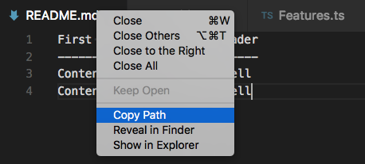
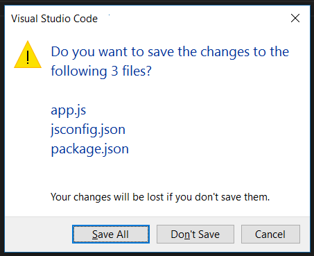
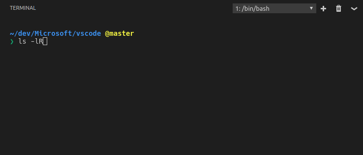
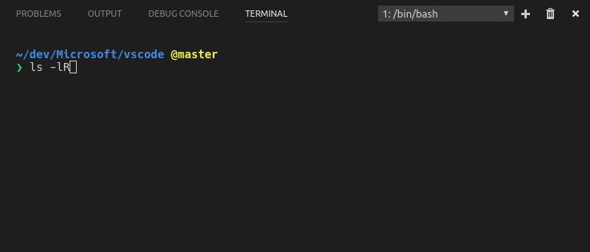
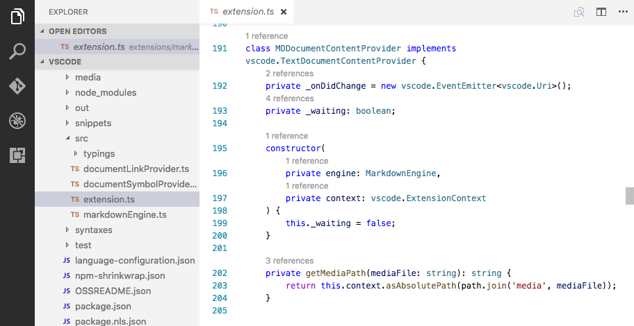
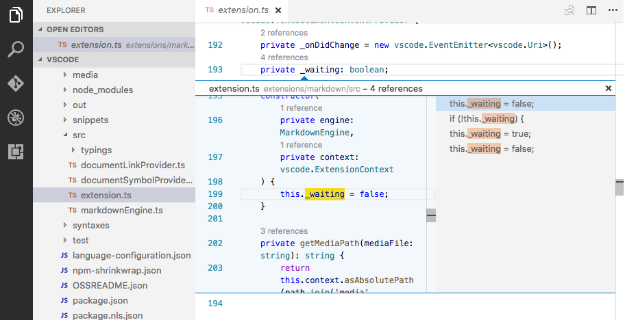

# January 2017 (version 1.9)

Welcome to the first 2017 release of Visual Studio Code. There are a number of significant updates in this version that we hope you will like, some of the key highlights include:

* **[Control menu visibility](#control-the-dimensions-of-new-windows)** - Hide or toggle the top VS Code menu.
* **[Markdown Preview and Editor Integration](#markdown-preview-and-editor-integration)** - View synchronization of a Markdown preview and its editor.
* **[Terminal performance and better Windows support](#terminal-improvements)** - The terminal is a lot faster and works better on Windows.

TBD add 10-12 highlights linking to h3 headers

The release notes are arranged in the following sections related to VS Code focus areas. Here are some further updates:

* **[Workbench](#workbench)** - New settings to control new windows, improved Tabbed headings.
* **[Editor](#editor)** - TBD details not mentioned in highlights.
* **[Languages](#languages)** - TBD details not mentioned in highlights.
* **[Extensions](#extensions)** - TBD details not mentioned in highlights.
* **[Node.js Debugging](#node-debugging)** - TBD details not mentioned in highlights.
* **[Extension Authoring](#extension-authoring)** - TBD details not mentioned in highlights.

## Workbench

### New entries in the context menu of tabs

Additional entries have been added to the context menu of tabs that show files. You can copy the path of the file or reveal it in the native OS explorer or the explorer in the side bar.



### New setting to control close button in tabs

We added a new setting `workbench.editor.tabCloseButton` that controls if the close button should show on the right (default), left or not be visible at all.


Note: the previous `workbench.editor.showTabCloseButton` was removed in favor of this new option.

### Panels title bar update

The title bar of the horizontal panel is now showing all the other panels that are available and thus makes it much easier to switch between panels.


### Control if files/folders should open in a new window or last active

There are many ways how to open files or folders when VS Code is already running and for each we have to make a decision whether they should open in the last active window or a new window. Previously we only had a simple setting `window.openFilesInNewWindow` to control this for files and by default, we would actually decide to open files into new windows, instead of reusing the last active window.

With this release, we want to make this more configurable and also change the default behavior for opening files.

A new setting `window.openFoldersInNewWindow` is provided to configure this behavior for folders and possible values are `default`, `on` and `off`. The existing (previously boolean) setting `window.openFilesInNewWindow` was changed to use these same values. In addition, `window.openFilesInNewWindow` now has the default value of `default` which in many cases will reuse the last active window instead of opening a new one.

If configured to be `default`, we will make the best decision about reusing a window or not based on the context from where the open request was made. Flip this to `on` or `off` to always behave the same. For example, if you feel that picking a file or folder from the **File** menu should open into a new window, set this to `on`.

Note: There can still be cases where this setting is ignored (for example, when using the `-new-window` or `-reuse-window` command line option).

### Control the dimensions of new windows

A new setting `window.newWindowDimensions` allows to control how new windows should open. By default, a new window will open in the center of the screen with small dimensions. If you change this setting to `inherit`, the new window will get the same dimensions as the last active one. Setting it to `maximized` or `fullscreen` will always open new windows either maximized or in fullscreen.

### Control menu visibility (Windows, Linux)

A new setting `window.menuBarVisibility` allows for more fine grained control over the top menu visibility on Windows and Linux. By `default`, the menu will be visible and only hides when entering full screen. You can set it to `toggle` to hide it. In the `toggle` state, the menu will show up when you press the `kbstyle(Alt)` key. If you turn the set the value to `hidden`, the menu will remain hidden, even if you press `kbstyle(Alt)`.

Note: If you configure the menu explicitly to be `visible`, it will also remain visible when you enter the fullscreen mode.

### Easy to close all editors when they are dirty

There are situations where you can easily end up with many dirty editors open (for example, you ran a search and replace operation without saving). Previously, when you wanted to close them all, you were asked to Save or Revert each editor one by one. Now, when you invoke the **Close All Editors** action (`kb(workbench.action.closeAllEditors)`), you will see a combined prompt for all dirty files:



### Compare editors now supports untitled documents

Previously only files could be compared that exist on disk. With this release you can compare any 2 documents, even if they are untitled.

### Tabs with same labels use much less space now

When you have multiple tabs open that show the same file name from different folders, we used to just show the full (workspace relative) path to those files so that you are able to distinguish one from the other. The downside of this approach is that tabs needs a lot more space:


With this release, we try to find a segment in the path that is different and then only show this to distinguish the two tabs:


### Rename or move dirty files without confirmation

You can now move or rename dirty files without having to save or revert the changes. Any moved or renamed dirty file will preserve the dirty content and dirty state without any confirmation needed.

### Always hot exit on folders

The `files.hotExit` setting has changed from a simple `true`/`false` setting to accept the following options:

- `"off"`: Disable hot exit (same as the old `false` setting).
- `"onExit"`: Enable hot exit when all VS Code windows are shut down (same as the old `true` setting).
- `"onExitAndWindowClose"`: Same as `"onExit"` but trigger hot exit when any folder window closes, regardless of whether it's the window or not. In order to enable more flexibility, this setting will also *not* restore folder windows when you next launch, `"window.reopenFolders": "all"` can be used to restore all previous windows when this setting is used.

### Terminal improvements

**Performance**

Much of the terminal frontend has been rewritten with performance in mind. In short it should no longer lock up the application when processing large amounts of data and it should process data about 5 times faster.

Before (v1.8.1):



After (v1.9.0):



**Windows support**

The library used to communicate with the terminal process on Windows has been upgraded which fixes many of the problems the terminal had on Windows such as arrow keys not functioning and the prompt line going out of sync. A special thanks to [Ryan Prichard](https://github.com/rprichard) for his [winpty](https://github.com/rprichard/winpty) library and for assisting with the upgrade.

**Other**

- **PowerShell on Windows 10**: PowerShell is now the default shell on Windows 10 to better align with the [new OS default](https://blogs.windows.com/windowsexperience/2016/11/17/announcing-windows-10-insider-preview-build-14971-for-pc/#fwfzEgffOGmVfEXs.97).
- **Right-click copy or paste**: On Windows similar to the cmd.exe feature, right clicking within the terminal will copy if there is a selection or paste if there is no selection. This is enabled by default on Windows and can be configured (on any platform) using the `terminal.integrated.rightClickCopyPaste` setting.
- **Cursor styles**: New line and underline cursor styles have been added to the terminal, these can be configured with the `terminal.integrated.cursorStyle` setting.
- **Wide character support**: Wide characters are now sized to consume exactly 2 character widths
- **Better space utilization**: The terminals within the terminal panel should now fill up as much space as possible

### Launch new instance from Unity/Ubuntu

The standard shortcuts to launch a new instance of an application from the Unity launcher now correctly open a new instance of VS Code (`kbstyle(Win+Shift+<number>)`, `kbstyle(Shift)`+click, middle click).

## Editor

### Format on Paste

We have added a new setting to enable format on paste. Update your settings to include `editor.formatOnPaste: true` and have code formatted on paste. Note that this work with existing formatters that support to format a selection such as the TypeScript formatter or other formatters from the marked place.

### Insert snippets

You can now bind your favorite snippets to keybindings. A sample that encloses a selection with single quotes looks like this:

```json
{
	"key": "cmd+k '",
	"command": "editor.action.insertSnippet",
	"args": { "snippet": "'$TM_SELECTED_TEXT'" }
}
```

Instead of defining a snippet with `snippet`, you can also refer to a snippet using the `name`-property, like `{ "name": "mySnippet" }`

### Go To Implementation

The new **Go to Implementation** and **Peek Implementation** commands allow you to quickly jump from an interface to its implementers, or from an abstract method to the method implementations.

## Languages

### TypeScript 2.1.5

VS Code now includes TypeScript 2.1.5. This release includes a number of important [bug fixes](https://github.com/Microsoft/TypeScript/issues?q=is%3Aissue+milestone%3A%22TypeScript+2.1.5%22+label%3A%22fixed%22+).

### TypeScript References Code Lens

The TypeScript references code lens displays an inline count of reference for classes, interfaces, methods, properties, and exported objects:



You can enable the TypeScript references code lens by setting `"typescript.referencesCodeLens.enabled": true`.

Click on the reference count to quickly browse a list of references:



### Support for Suggestions and Formatting in Unsaved JavaScript and TypeScript Files

Normal suggestion and formatting are now enabled for unsaved JavaScript and TypeScript files when using TypeScript 2.1.5+. Previously the file had to be saved to disk to enable these features.

### Icons For TypeScript File and Folder Completions

TypeScript file and folder completion items are now displayed using the corresponding file and folder icons.


### Markdown Preview and Editor Integration

VS Code can now synchronize the view of a Markdown editor and its preview. By default, the Markdown preview will automatically scroll to reveal the element at the selected line in the editor.


Also, when the Markdown preview is scrolled, the editor will scroll along with it:


Additionally, you can now double click an element in the Markdown preview to automatically open the editor at that line:


**Other Markdown Improvements**

* Syntax highlighting for C++, Go, Rust, and Scala code blocks in markdown files.
* Fixed Markdown syntax highlighting for block elements on a line immediately after a paragraph.
* When the Markdown preview is first opened, it will automatically scroll to the selected line in the editor.
* A gray bar in the left margin of the Markdown preview indicates the currently selected line.
* Links to local files now work in the Markdown preview.
* In the Markdown editor, you can ctrl click on links to local files to open them in the editor.

### Load Emmet preferences, profiles, snippets and abbreviations from external files

The new setting `emmet.extensionsPath` can be used to provide a location (absolute path) where any or all of `snippets.json`, `syntaxProfiles.json` and `preferences.json` reside. Read more about how to customize Emmet abbreviations at [Emmet Customization](http://docs.emmet.io/customization/).

The existing settings `emmet.preferences` and `emmet.syntaxProfiles` will override the values from the above json files.

Note: The file contents are cached. Therefore, you will need to reload the Visual Studio Code window for the changes in the json files to be reflected.

## Extensions

### Item

## Node Debugging

### Item

## Extension Authoring

### Editor API to insert a snippet

There is a new `TextEditor#edit` overload that allows you to insert a `StringString` into an editor.

### Updating Code Lenses

A `CodeLensProvider` can now have a `onDidChangeCodeLenses`-event which signals to the editor that lenses have changed and need to be refreshed.

### Completion item commit characters

`CompletionItems` can now have a list of commit characters. When a commit character is typed and while a completion is selected, the completion will be inserted as the character is being typed. 

### Added new Implementation Provider API

A new `ImplementationProvider` interface was added to support the new **Go to Implementation** feature. A `ImplementationProvider` maps a location in a text document to a list of implementations locations, for example going from an interface to classes that implement this interface or from an abstract method to a list of implementing methods. 

Extensions that wish to support **Go to Implementation** can implement `ImplementationProvider` and register the provider using `vscode.languages.registerImplementationProvider`

### New API to open an untitled file with optional language

A new overload was added to the `openTextDocument` method that allows to open an untitled document with optional language. For example you can call:

`openTextDocument({ language: 'xml' })`

To create a text document with XML as language. If you leave out the language options, it will just create a text document with plain text language.

### `TextEditorRevealType.AtTop`

A new `AtTop` value was added to the `TextEditorRevealType` enum. This reveals the range at the top of the viewport.

### `CompletionItemKind.Folder`

A new `Folder` value was added to the `CompletionItemKind` enum.


### Breaking Change: TBD

### Item

## Miscellaneous

### Item

## New Commands

Key|Command|Command id
---|-------|----------
`kb(commandid)`|Command Palette description|`commandid`

## Notable Changes

* [16803](https://github.com/Microsoft/vscode/issues/16803): Preserve language picked for untitled text documents
* [16588](https://github.com/Microsoft/vscode/issues/16588): Preserve view state for untitled files between restarts
* [17408](https://github.com/Microsoft/vscode/issues/17408): Search does not work in UTF-16 LE encoded files
* [12831](https://github.com/Microsoft/vscode/issues/12831): Support standard tab navigation key shortcuts on macOS
* [10444](https://github.com/Microsoft/vscode/issues/10444): Persist character encoding of open files across restart
* [18037](https://github.com/Microsoft/vscode/issues/18037): Possible to save file multiple times leads to race condition
* [14464](https://github.com/Microsoft/vscode/issues/14464): Preserve editor relative sizes when switching layouts
* [18003](https://github.com/Microsoft/vscode/issues/18003): Search relevance in Quick Pick control
* [14625](https://github.com/Microsoft/vscode/issues/14625): Update menu when reassigning keybindings or installing keybinding extension
* [18290](https://github.com/Microsoft/vscode/issues/18290): Moving or renaming file does not preserve editor view state
* [12040](https://github.com/Microsoft/vscode/issues/12040): Identical file name path in tab is too long and difficult to diff
* [17495](https://github.com/Microsoft/vscode/issues/17495): Explorer: Does not sort files and folders with numerical values accordingly
* [7876](https://github.com/Microsoft/vscode/issues/7876): Allow to use Ctrl P/N for up and down navigation in quick open
* [6502](https://github.com/Microsoft/vscode/issues/6502): Apply excludes to editor history quick open too
* [18679](https://github.com/Microsoft/vscode/issues/18679): F4 added as a keybinding to navigate search results - may conflict with some extension keybindings
* [11908](https://github.com/Microsoft/vscode/issues/11908): ALT + Arrows does not work in integrated terminal
* [14479](https://github.com/Microsoft/vscode/issues/14479): Integrated Terminal eats half of the first line when you zoom
* [18952](https://github.com/Microsoft/vscode/issues/18952): Terminal tab stops broken after resize
* [18332](https://github.com/Microsoft/vscode/issues/18332): Background terminal scroll bars are not synced when the foreground terminal is resized

These are the [closed bugs](https://github.com/Microsoft/vscode/issues?q=is%3Aissue+label%3Abug+milestone%3A%22January+2017%22+is%3Aclosed) and these are the [closed feature requests](https://github.com/Microsoft/vscode/issues?q=is%3Aissue+milestone%3A%22January+2017%22+is%3Aclosed+label%3Afeature-request) for the 1.9 update.

## Contributions to Extensions

Our team maintains or contributes to a number of VS Code extensions. Most notably:

* [Go](https://marketplace.visualstudio.com/items?itemName=lukehoban.Go)
* [Python](https://marketplace.visualstudio.com/items?itemName=donjayamanne.python)
* [TSLint](https://marketplace.visualstudio.com/items?itemName=eg2.tslint)
* [ESLint](https://marketplace.visualstudio.com/items?itemName=dbaeumer.vscode-eslint)
* [Debugger for Chrome](https://marketplace.visualstudio.com/items?itemName=msjsdiag.debugger-for-chrome)
* [VSCodeVim](https://marketplace.visualstudio.com/items?itemName=vscodevim.vim)

## Thank You

Last but certainly not least, a big *__Thank You!__* to the following folks that helped to make VS Code even better:

TBD The contribution list is autogenerated

* [TBD (@tbd)](https://github.com/tbd):  TBD [PR #TBD](https://github.com/Microsoft/vscode/pull/TBD)

Contributions to `vscode-eslint`:

* [Giovanni Calò (@giovannicalo)](https://github.com/giovannicalo): Fixed typo [PR #190](https://github.com/Microsoft/vscode-eslint/pull/190)

Contributions to `vscode-languageserver-node`:

* [Per Lundberg (@perlun)](https://github.com/perlun): README.md: Fixed typos [PR #138](https://github.com/Microsoft/vscode-languageserver-node/pull/138)
* [Federico Bond](https://github.com/federicobond): Fix typo [PR #144](https://github.com/Microsoft/vscode-languageserver-node/pull/144)

Contributions to `language-server-protocol`:

* [Guillaume Martres (@smarter)](https://github.com/smarter): Fix incorrect numbering in CompletionItemKind [#151](https://github.com/Microsoft/language-server-protocol/pull/151)
* [Olivier Thomann (@othomann)](https://github.com/othomann): Fix some typos [#149](https://github.com/Microsoft/language-server-protocol/pull/149)

<!-- In-product release notes styles.  Do not modify without also modifying regex in gulpfile.common.js -->
<a id="scroll-to-top" role="button" aria-label="scroll to top" onclick="scroll(0,0); event.preventDefault(); event.stopPropagation()"><span class="icon"></span></a>
<link rel="stylesheet" type="text/css" href="css/inproduct_releasenotes.css"/>
